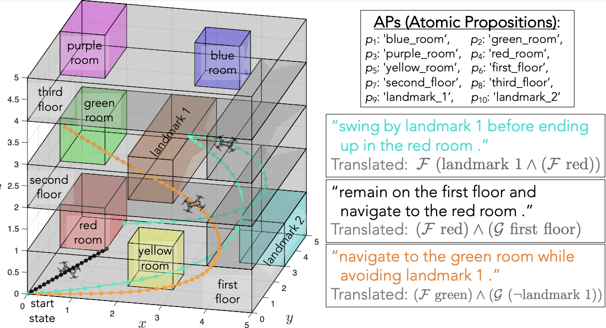

# Open source Logic-LLM

### Authors

---

*Abstract very short*
---

## Introduction
Logic-LM is a novel framework, proposed by Pan et al. (2023) \[1\], that combines Large Language Models (LLMs) and Symbolic Solvers for reasoning tasks . Leveraging the translative power of LLMs, they counterbalance potential inaccuracies in reasoning by employing Symbolic Solvers (Shanan, 2022) \[2\].

<!--Logic-LM, proposed by Pan et al. (2023) [1], introduces a novel framework that merges Large Language Models (LLMs) with Symbolic Solvers for reasoning tasks. Leveraging the translative power of LLMs, they counterbalance potential inaccuracies in reasoning by employing Symbolic Solvers [2]. Recent advancements in adapting LLMs for logical reasoning tasks have seen approaches like fine-tuning and in-context learning, which optimize LLMs' reasoning ability through specialized training modules or prompt-based step-by-step reasoning. While these methods operate directly over natural language, the Logic-LM framework stands out by utilizing symbolic language for reasoning, transferring complex tasks to external symbolic solvers while leveraging LLMs for problem formulation. Unlike prior neuro-symbolic methods, which often require specialized modules and suffer from optimization challenges, Logic-LM seamlessly integrates modern LLMs with symbolic logic, offering a more generalizable solution. Additionally, this work explores tool-augmented LLMs, extending their capabilities beyond language comprehension by integrating external tools for improved performance on logical reasoning tasks. Auto-formalization, widely applied in mathematical reasoning, finds a pioneering extension in Logic-LM to a broader range of logical reasoning tasks, bridging the gap between natural language understanding and formal logic with modern LLMs.-->

### Related work
<!-- Nog niet goed -->
Recent advancements in adapting Large Language Models (LLMs) for logical reasoning tasks can be categorized into two main approaches: fine-tuning and in-context learning. Fine-tuning methods optimize LLMs' reasoning ability through specialized training modules (Clark et al., 2020; Tafjord et al., 2022; Yang et al., 2022), while in-context learning designs prompts to elicit step-by-step reasoning. Chain-of-Thought prompting (Wei et al., 2022b; Wang et al., 2023) is an example of in-context learning, in which explanaitions are generated before the final answer. While these methods operate directly over natural language, the Logic-LM framework stands out by utilizing symbolic language for reasoning, transferring complex tasks to external symbolic solvers while leveraging LLMs for problem formulation. Unlike prior neuro-symbolic methods (Mao et al., 2019; Gupta et al., 2020; Manhaeve et al., 2021; Cai et al., 2021; Tian et al., 2022; Pryor et al., 2023), which often require specialized modules and suffer from optimization challenges, the Logic-LM framework integrates modern LLMs with symbolic logic without the need for complex module designs, offering a more generalizable solution. Additionally, this work explores tool-augmented LLMs, extending their capabilities beyond language comprehension by integrating external tools for improved performance on logical reasoning tasks. While auto-formalization has been widely applied in mathematical reasoning (Wu et al., 2022; Drori et al., 2022; He-Yueya et al., 2023; Jiang et al., 2023), Pan et al. (2023) pioneer its extension to a broader range of logical reasoning tasks, bridging the gap between natural language understanding and formal logic with modern LLMs.

### Logic-LM framework
<!--The Problem Formulation stage prompts an LLM to translate the problem into symbolic language, leveraging the model's few-shot generalization ability. We use four symbolic formulations to cover different types of logical reasoning problems. Then, in the Symbolic Reasoning stage, we call external solvers based on the problem type, such as Pyke for deductive reasoning or Z3 for SAT problems. Finally, the Result Interpreter translates the solver's output back into natural language. Additionally, a Self-Refiner module adjusts inaccurate logical formulations based on solver feedback. This framework reduces the burden on LLMs by focusing on symbolic representation rather than step-by-step reasoning.-->

The Logic-LM decomposes a logical reasoning problem into three stages: stages: *Problem Formulation*,
*Symbolic Reasoning*, and *Result Interpretation*. The *Problem Formulation* prompts an LLM to translate a natural language problem into symbolic language, utilizing the few-shot generalization ability of LLMs. The LLM is provided with instructions about the grammar of the symbolic language alongside in-context examples. Specifically, four different symbolic formulations are used to cover four common types of logical reasoning problems: deductive reasoning, firstorder logic reasoning, constraint satisfaction problem, and analytical reasoning. Afterwards, in the *Symbolic Reasoning* stage, external solvers perform inference on the symbolic representation. Based on the problem type a different solver is used, such as Pyke (Frederiksen, 2008) for deductive reasoning or Z3 (de Moura and Bjørner, 2008) for SAT problems. The *Result Interpreter* explains the output of the solver and maps it to the correct answer. Moreover, a self-refinement module is introduced which improves accuracy by iteratively revising symbolic formulations using error messages from the solvers. This module instructs the LLM to refine incorrect logical forms by promptinh it with the erroneous logic form, the solver’s error message, and a set of demonstrations showing common error cases and remedies.

| Problem                | Formulation | NL Sentence                                                                 |            Symbolic Formulation                                     |                Solver                  |      Dataset       |      
|------------------------|-------------|-----------------------------------------------------------------------------|---------------------------------------------------------|-----------------------------------------------------|-------------------|
| Deductive Reasoning    | LP          | If the circuit is complete and the circuit has the light bulb then the light bulb is glowing. | Complete(Circuit, True) ∧ Has(Circuit, LightBulb) → Glowing(LightBulb, True) | Pyke              | ProntoQA, ProofWriter |
| First-Order Logic      | FOL         | A Czech person wrote a book in 1946.                                        | ∃x₂∃x₁(Czech(x₁) ∧ Author(x₂, x₁) ∧ Book(x₂) ∧ Publish(x₂, 1946)) | Prover9           | FOLIO                 |
| Constraint Satisfaction| CSP         | On a shelf, there are five books. The blue book is to the right of the yellow book. | blue_book ∈ {1, 2, 3, 4, 5} yellow_book ∈ {1, 2, 3, 4, 5} blue_book > yellow_book | python-constraint | LogicalDeduction      |
| Analytical Reasoning   | SAT         | Xena and exactly three other technicians repair radios                      | repairs(Xena, radios) ∧ Count([t:technicians], t ≠ Xena ∧ repairs(t, radios)) == 3 | Z3                | AR-LSAT               |
| Temporal reasoning  | LTL         | Go through the red room to the second floor.                    |F(red_room ∧ F (second_floor)) | Buchi Automaton                | Done Planning             |

**Table 1**: A summary of the symbolic formulations and symbolic solvers we use for cateogies of logical reasoning in our study.

### Experiments
The performance of three GPT models serving as underlying models for the Problem Formulator of Logic-LM (ChatGPT, GPT-3.5, and GPT-4) is evaluated against two baselines: 1) Standard LLMs, which leverage incontext learning to directly answer the question; and 2) Chain-of-Thought (CoT) (Wei et al., 2022b), which adopts a step-by-step problem-solving approach. The performance is evaluated across five logical reasoning datasets. *PrOntoQA* (Saparov and He, 2023)offers synthetic challenges for deductive reasoning, with the hardest 5-hop subset tested. *ProofWriter* (Tafjord et al., 2021) presents problems in a more natural language form under the open-world assumption, focusing on different levels of reasoning depth, with the depth-5 subset chosen for evaluation. *FOLIO* (Han et al., 2022), a challenging expert-written dataset, demands complex first-order logic reasoning. *LogicalDeduction* (Srivastava et al.,2022) from BigBench and *AR-LSAT* (Zhong et al., 2022) present real-world scenarios and analytical logic reasoning questions, respectively, adding diversity to the evaluation. 

<!--The performance of three GPT models serving as underlying models for the Problem Formulator of Logic-LM (ChatGPT, GPT-3.5, and GPT-4) is evaluated against two baselines: 1) Standard LLMs, which use in-context learning to answer questions directly; and 2) Chain-of-Thought (CoT), adopting a step-by-step problem-solving approach. The evaluation spans five logical reasoning datasets: PrOntoQA, ProofWriter, FOLIO, LogicalDeduction, and AR-LSAT, each offering distinct challenges. PrOntoQA provides synthetic challenges for deductive reasoning, while ProofWriter presents problems in a more natural language form. FOLIO demands complex first-order logic reasoning, while LogicalDeduction and AR-LSAT present real-world scenarios and analytical logic reasoning questions, respectively, adding diversity to the evaluation.-->

### Main results
Pan et al. (2023) present three main results. First, LOGIC-LM notably outperforms standard LLMs and Chain-of-Thought (CoT) across various datasets, showcasing the advantage of integrating LLMs with external symbolic solvers for logical reasoning. Second, GPT-4 exhibits superior performance compared to GPT-3.5, especially in standard prompting. Logic-LM further improves GPT-4 24.98% and 10.44% for standard
prompting and CoT prompting, respectively. Third, while CoT generally enhances LLM performance, its benefits vary across datasets, with less substantial or negative effects seen in certain scenarios. Additionally, the effectiveness of problem formulation, the robustness of reasoning, and the impact of self-refinement, highlight both the successes and challenges encountered in these areas.

<!--Pan et al. (2023) report three main results. First, LOGIC-LM notably outperforms standard LLMs and Chain-of-Thought (CoT) across various datasets, highlighting the advantage of integrating LLMs with external symbolic solvers for logical reasoning. Second, GPT-4 exhibits superior performance compared to GPT-3.5, especially in standard prompting. Logic-LM further improves GPT-4 by 24.98% and 10.44% for standard prompting and CoT prompting, respectively. Third, while CoT generally enhances LLM performance, its benefits vary across datasets, with less substantial or negative effects seen in certain scenarios. Additionally, the effectiveness of problem formulation, the robustness of reasoning, and the impact of self-refinement highlight both the successes and challenges encountered in these areas.-->

## <a name="reasons">Reasons for extension</a>
*Exposition of its weaknesses/strengths/potential which triggered your group to come up with a response.*

As outlined in the introduction, the Logic-LM framework relies on three LLMs: ChatGPT, GPT-3.5, and GPT-4. However, due to their closed-source nature, these models suffer from limited transparency, customization options, and opportunities for collaboration. Therefore,  integrating open-source LLMs into the Logic-LM framework would be beneficial, as it increases accessibility, usability and flexibility. 

The authors of Logic-LM pointed out a crucial constraint, stating that “the model’s applicability is inherently bounded by the expressiveness of the symbolic solver”. Currently, only four distinct symbolic solvers are employed, limiting the framework's scope to four specific types of logical reasoning problems. Despite this, the authors proposed a solution, emphasizing that “this limitation can be mitigated by integrating a more diverse set of symbolic solvers”. Therefore, incorporating an additional solver type expands the framework’s capabilities, which is facilitated by the inherent flexibility of its design. Moreover, this addition encourages the development of a versatile logic-solving model. 

## <a name="reasons">Open-source models</a>
Our first extension is making Logic-LM work with open-source language models, instead of closed-source models like ChatGPT. To make the application as flexible as possible, this was appplied by using models from the Huggingface library TODO:Add link. This library contains a large variety of pre-trained open-source language models. For this project two versions of Meta's Llama-3 model were used, since these are current state-of-the-art open-source models (add ref). The first model is the 8B version of Llama-3 and the second is the 70B version. The former is a smaller version of the model, while the second is significantly larger and thus should have better performance. These models will be compared with the GPT models used by the original author to see how SoTA open-source models compare to closed-source models. By using two versions of this model we can also research the difference in performance between smaller and more complex models. 

## <a name="ltl">Linear Temporal Logic</a>
We extend the Logic-LLM by introducing Linear-time Temporal Logic (LTL). 
 Linear-time Temporal Logic extends standard propositional logic to express properties that hold over trajectories across time. LTL adheres to the following grammar:

| Syntax        | Description           |
|---------------|-----------------------|
| $p_a$      | Atomic Proposition    |
|$\neg \phi$ | Negation              |
| $\phi \land \psi$ | And                |
| $\phi \lor \psi$ | Or                 |
| $\phi \Rightarrow \psi$ | Imply            |
| $\phi U \psi$ | $\phi$ Until $\psi$      |
| $F \phi$    | Eventually           |
| $X \phi$    | Next                 |
| $G \phi$    | Always               |

We employ open source large language models (LLM) to convert natural language into Linear Temporal Logic (LTL) tasks based on the attributes in the planning domain. **(Mention the methodology for prompting)**

Consider the Natural language command $\mu$ : *Without stepping outside the orange room, go to landmark one*, where the terms *orange room* and *landmark one* belong to the predicates in the predetermined planning domain. From the given context, the LLM is able to identify and determine the relevant predicates such as the room and/or floor description. We use the LLM to translate $\mu$ into an LTL formula in CNF $\phi_{\mu}$ = F(landmark_1) & G (orange_room), and consequently employ a python module (**source**) to find its associated Determininistic Finite state Automaton $M_{\phi}$.

Since Large language models are predominantly trained on natural language and may encounter difficulties when processing text transcriptions of Linear Temporal Logic (LTL) formulas. The syntax of LTL (e.g. U and F) is quite different from typical natural language constructs. To address this distribution shift, a study [X] proposes creating a "canonical" representation that aligns more closely with natural language. In the prompt we ask the LLM to turn $\mu$ into an intermediate 'canoncial form' before mapping the the sentence into an LTL formula.

|Natural Language ($\mu$)| Canonical form      | Raw LTL form     |
|-----------------------------------------|-----------------------------------------|-------------------------------------|
|Always avoid the green room and navigate to the third floor. | finally ( and ( the third floor , not ( the green room ) ) ) | F ( third_floor & ! green_room ) |

------
**Example Prompt**

*Given a context, question and options. The task is to first parse the question into a canonical formular and then from this formula to raw LTL formula. Also the options need to parsed into traces.
Below an explanaition is given of all the input you will recieve and what you should do with it.
Context: Declares the scene in which the question needs to be answered. Use this knowledge to parse the question and the options.*

*Question: Contains the question that needs to be answered. The task is to parse the question into a canonical formula and then based on the canonical formular to a raw LTL formula.*

*Your raw LTL formula answers always need to follow the following output format and you always have to try to provide a LTL formula. You may repeat your answers.*

*Remember that U means "until", G means "globally", F means "finally", which means GF means "infinitely often".*

*The formula should only contain atomic propositions or operators ||, &, !, U, G, F.*

*Options: The options need to be parsed into traces. These traces need to be a list ([]) containing dictionaries for each timestep ({}). In each dictionary the state of the corresponding timestep is given.*

------
##### Context:
*Our environment consists of grid-based rooms across multiple floors. Each floor features distinct rooms: the first floor has a red room and a yellow room, the second floor has a green room, and the third floor includes a purple room, an orange room, and Landmark 1.* *The drone’s movement is limited to one floor and not more than one room at a time within this structured environment. This setup is crucial for guiding effective planning and decision-making processes within the context of our problem.*

*Question:*
*always avoid the green room and navigate to the third floor. Which one of the following is a possible path for the drone to follow?
Options:*

(A) From the third floor go to the green room and stay there,

(B) Go inside the red room and then move to the green room,

(C) Go to the second floor passing the yellow room and then go to the third floor

------

### <a name="ltl">Symbolic Reasoner</a>
### Buchi Automaton 

For temporal reasoning, we incorporate a library for translating LTL formulas (in CNF form) with finite-trace semantics into a minimal Deterministic Finite state Automaton (DFA) using MONA [3]. This DFA captures the temporal constraints specified by the LTL formula and enables efficient reasoning over finite traces.

The trace-based satisfiability reasoning enhances the framework's ability to handle temporal aspects of logical reasoning problems. 
- Co-safe LTL formulae can be translated into $M_{\phi}$ using the model checking tool Flloat based on Mesa. 

- Using few shot learning we create a mapping between natural language commands and their associated LTL formula. For example, *Every a is eventually followed by an e,* may be parsed into *G(a -> Fe)*. And *The gate remains closed untill the train leaves the crossing* can be translated to *gate-closed U train-exists*. Given a prompt, an open source LLM can be instructed to create such LTL formulae from natural langauge. 
- Traces are possible executions
- Model checking for the validity of traces

Generate a trace with *atomic propositions* $p_i : V \rightarrow \{ false, true \}$ for each $i \in P$. Denote the set of atomic propositions as $AP(s) := { p_a(s) | a \in P_i, i = 1, ..., N}$.

For example $p_a(s)$ being true might describe that the drone is located in the *red room*. 

**Definition 1: (Büchi automaton)**: A deterministic Büchi automaton (DBA) is a tuple B = (Q, Σ, δ, q₀, F) where:
- Q is a finite set of states,
- Σ is the input alphabet,
- δ : Q × Σ → Q is the transition function,
- q₀ ∈ Q is the initial state, and
- F is the acceptance condition.

<table align="center">
  <tr align="center">
      <td></td>
  </tr>
  <tr align="left">
    <td colspan=2><b>Figure 1.</b> Pipeline.</td>
  </tr>
</table>

 

#### <a name="ltl">Environment Setup: Drone Planning Domain</a>

<table align="center">
  <tr align="center">
      <td></td>
  </tr>
  <tr align="left">
    <td colspan=2><b>Figure 2.</b> (caption) source: https://github.com/UM-ARM-Lab/Efficient-Eng-2-LTL/tree/main .</td>
  </tr>
</table>
We use the same planning domain as introduced by Oh et al. [4].
A 3D grid world $\Epsilon_1$ comprised of three floors, six rooms, and a single landmark. Both rooms, floor, and the landmark form levels of abstraction. The landmark is of level 0, the rooms of level 1, and the floor at level 2. 

We evaluate the extension of Logic_LM on a dataset create for a Drone Planning domain. 
- Drone navigation command in natural language into an LTL expression
- Different paper feeds this LTL expression in to a trajectory planner that can plan the task in a predefined environment.
- Instead, we add the predefined environment in Natural Langauge to the multiple Choice questions.
- We are dealing with two levels of abstraction, the floor and the room. Being in the red room implies being on the first floor.  

#### Language Grounding Results
We aim to test how well the few shot learning performs the natural language to LTL conversion. 
TO DO. 

#### Effectiveness of Problem Formulator
We assess the proficiency of LLM in transforming a provided problem into the symbolic representation (LTL) employed by the Buchi Automaton. The following table reports the accuracy over a variety of LTL formulae. 
**TO DO**

[NL2LTL](https://github.com/realChrisHahn2/nl2spec/blob/main/experiments/nl2spec-paper_experiment_results.csv)

## <a name="contribution">Novel contribution</a>
*Describe your novel contribution.*

## <a name="results">Results</a>
### <a name="general results">Main results</a>
<table align="center">
	<tr align="center">
		<th align="left"></th>
		<th></th>
		<th>Llama-3 (8B)</th>
		<th></th>
		<th></th>
		<th>Llama-3 (70B)</th>
		<th></th>
	</tr>
	<tr align="center">
		<th align="left">Dataset</th>
		<th>Standard</th>
		<th>GoT</th>
		<th>Logic-LM</th>
		<th>Standard</th>
		<th>GoT</th>
		<th>Logic-LM</th>
	</tr>
	<tr align="center">
		<td align="left">ProntoQA</td>
		<td>48.80</td>
		<td><b>81.00</b></td>
		<td>67.40</td>
		<td></td>
		<td></td>
		<td></td>
	</tr>
	<tr align="center">
		<td align="left">Proofwriter</td>
		<td>34.33</td>
		<td><b>49.17</b></td>
		<td>37.83</td>
		<td></td>
		<td></td>
		<td></td>
	</tr>
	<tr align="center">
		<td align="left">FOLIO</td>
		<td><b>51.96</b></td>
		<td>51.00</td>
		<td>36.27</td>
		<td></td>
		<td></td>
		<td></td>
	</tr>
	<tr align="center">
		<td align="left">LogicalDeduction</td>
		<td>35.33</td>
		<td>39.00</td>
		<td><b>60.67</b></td>
		<td></td>
		<td></td>
		<td></td>
	</tr>
	<tr align="center">
		<td align="left">AR-LSAT</td>
		<td><b>24.68</b></td>
		<td>20.80</td>
		<td>15.15</td>
		<td></td>
		<td></td>
		<td></td>
	</tr>
	<tr align="left">
		<td colspan=7><b>Table 1.</b> Accuracy of standard prompting (Standard), chain-of-thought prompting (CoT), and our method (LOGICLM, without self-refinement) across five reasoning datasets using the Llama-3 model. The best results for each base LLM are highlighted.</td>
	</tr>
</table>

Table 1 shows the results of the experiments with the open-source model.  It displays that Logic-LM only scored highest on the LogicalDeduction dataset, where it scored 60.67 compared to 35.33 and 39.00 for Standard and CoT respectively. For the other datasets Logic-LM got outperformed by either the Standard or the CoT model. TODO: Insert % of how much better/worse

Comparing these results to the GPT model results, we observe that Llama generally performs worse than the GPT models. Logic-LM has significantly lower scores compared to all GPT models for the Proofwriter, FOLIO and AR-LSAT dataset and slight lower scores for the LogicalDeduction dataset. Only on the PrOntoQA Llama achieved a higher score than gpt-3.5-turbo, while still having worse scores when using the other GPT models. For the Standard and CoT method we observe similar performance to gpt-3.5-turbo while also being outperformed by the other GPT models.

### <a name="sr results">Self-refinement</a>
<table align="center">
	<tr align="center">
		<th align="left"></th>
		<th></th>
		<th>Llama-3 (8B)</th>
		<th></th>
		<th>Llama-3 (70B)</th>
		<th></th>
	</tr>
	<tr align="center">
		<th align="left">Dataset</th>
		<th>Refinement</th>
		<th>Exec-rate</th>
		<th>Exec-acc</th>
		<th>Exec-rate</th>
		<th>Exec-acc</th>
	</tr>
	<tr align="center">
		<td align="left">ProntoQA</td>
		<td>-</td>
		<td>91.60</td>
		<td>69.65</td>
		<td></td>
		<td></td>
	</tr>
	<tr align="center">
		<td ></td>
		<td>+</td>
		<td></td>
		<td></td>
		<td></td>
		<td></td>
	</tr>
	<tr align="center">
		<td align="left">Proofwriter</td>
		<td>-</td>
		<td>13.00</td>
		<td>70.51</td>
		<td></td>
		<td></td>
	</tr>
	<tr align="center">
		<td ></td>
		<td>+</td>
		<td></td>
		<td></td>
		<td></td>
		<td></td>
	</tr>
	<tr align="center">
		<td align="left">FOLIO</td>
		<td>-</td>
		<td>37.25</td>
		<td>48.68</td>
		<td></td>
		<td></td>
	</tr>
	<tr align="center">
		<td ></td>
		<td>+</td>
		<td></td>
		<td></td>
		<td></td>
		<td></td>
	</tr>
	<tr align="center">
		<td align="left">LogicalDeduction</td>
		<td>-</td>
		<td>100.00</td>
		<td>60.67</td>
		<td></td>
		<td></td>
	</tr>
	<tr align="center">
		<td ></td>
		<td>+</td>
		<td></td>
		<td></td>
		<td></td>
		<td></td>
	</tr>
	<tr align="center">
		<td align="left">AR-LSAT</td>
		<td>-</td>
		<td>20.35</td>
		<td>21.28</td>
		<td></td>
		<td></td>
	</tr>
	<tr align="center">
		<td ></td>
		<td>+</td>
		<td></td>
		<td></td>
		<td></td>
		<td></td>
	</tr>
	<tr align="left">
		<td colspan=7><b>Table 2.</b>  TODO: Give title.</td>
	</tr>
</table>
Table 2 displays a comparison of self-refinement

## <a name="conclusion">Conclusion</a>
Our experiments show that it is possible to use Logic-LM with open-source language models. However the achieved performance with one SoTA open-source language model (Llama-3) is clearly lower than the performance of the closed-source GPT models. The GPT models scored better on all datasets except on PrOntoQA, where Llama performed better than ChatGPT. Interestingly with the Standard and CoT method similar performance was achieved to ChatGPT and GPT 3.5, so only Logic-LM really drops in performance with the open-source model. It should be noted that once better open-source models become available, they could perform equally as good or better than closed-source models, since the achieved performance is evidently related to the used language model. 

Using Llama-3 we observed that the performance of Logic-LM is significantly worse than the Standard and CoT methods, except on the LogicalDeduction dataset, where Logic-LM performed slightly better. This contradicts the findings of the original authors, since they found Logic-LM to outperform the other 2 methods on almost all datasets with all three GPT models. This is likely due to a difference in performance of the open-source language model itself. Moreover the difference could lead to wrong input for the logic solvers, making them unable to correctly solve the problems. 

## Authors' Contributions
*example*
- Jonathan: Initial setup of codebase & implementation of architecture ablation studies, implementation of transformer architectures, implementation of FID metric, training of ablation models, wrote novel model architecture. Loss plots
- Ana: did ablation study for activation functions and normalization, bias research, model architecture diagram, wrote Image Editing with Diffusion Models (partly), Discovering Semantic Latent Space (training loss part), Model Architecture, Evaluating Diffusion Models and Concluding Remarks.
- Luc: did DM vs LDM research and notebook; wrote header, Image Editing Using Diffusion Models (partly), Recap on Diffusion Models, the Discovering Semantic Latent Space, Bias in Editing Directions (partly), Ablation Study, and Further Research: Latent Diffusion Models. 
- Eric: Structure of the repository, implementations, reproducibility experiment configurations, executions, visualizations, and analysis for "Reproduction of the Experiments", collaboration on the initial implementation of the transformer-based architecture, help as needed with run executions, figures, and tables for other sections.

## Bibliography

[1] Pan, L., Albalak, A., Wang, X., & Wang, W. Y. (2023). Logic-lm: Empowering large language models with symbolic solvers for faithful logical reasoning. arXiv preprint arXiv:2305.12295.

[2] Murray Shanahan. 2022. Talking about large language models. CoRR, abs/2212.03551.

[3] Francesco Fuggitti. 2019. LTLf2DFA (Version 1.0.3). Zenodo. DOI: 10.5281/zenodo.3888410. Available at: https://github.com/whitemech/LTLf2DFA and http://ltlf2dfa.diag.uniroma1.it.

[4] Y. Oh, R. Patel, T. Nguyen, B. Huang, E. Pavlick, and S. Tellex, "Planning with State Abstractions for Non-Markovian Task Specifications," CoRR, vol. abs/1905.12096, 2019. [Online]. Available: http://arxiv.org/abs/1905.12096
