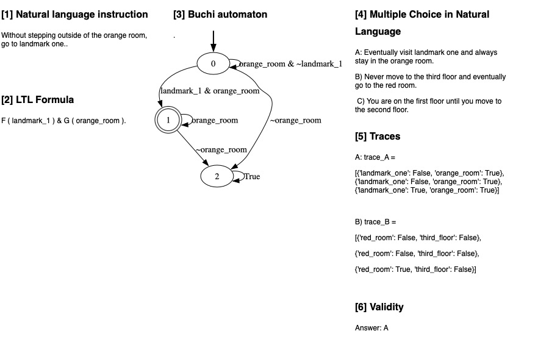

# Open source Logic-LLM

### Authors

---

*Abstract very short*
---

## Introduction
Logic-LM is a novel framework, proposed by Pan et al. (2023) \[1\], that combines Large Language Models (LLMs) and Symbolic Solvers for reasoning tasks . Leveraging the translative power of LLMs, they counterbalance potential inaccuracies in reasoning by employing Symbolic Solvers (Shanan, 2022) \[2\].

<!--Logic-LM, proposed by Pan et al. (2023) [1], introduces a novel framework that merges Large Language Models (LLMs) with Symbolic Solvers for reasoning tasks. Leveraging the translative power of LLMs, they counterbalance potential inaccuracies in reasoning by employing Symbolic Solvers [2]. Recent advancements in adapting LLMs for logical reasoning tasks have seen approaches like fine-tuning and in-context learning, which optimize LLMs' reasoning ability through specialized training modules or prompt-based step-by-step reasoning. While these methods operate directly over natural language, the Logic-LM framework stands out by utilizing symbolic language for reasoning, transferring complex tasks to external symbolic solvers while leveraging LLMs for problem formulation. Unlike prior neuro-symbolic methods, which often require specialized modules and suffer from optimization challenges, Logic-LM seamlessly integrates modern LLMs with symbolic logic, offering a more generalizable solution. Additionally, this work explores tool-augmented LLMs, extending their capabilities beyond language comprehension by integrating external tools for improved performance on logical reasoning tasks. Auto-formalization, widely applied in mathematical reasoning, finds a pioneering extension in Logic-LM to a broader range of logical reasoning tasks, bridging the gap between natural language understanding and formal logic with modern LLMs.-->

### Related work
<!-- Nog niet goed -->
Recent advancements in adapting Large Language Models (LLMs) for logical reasoning tasks can be categorized into two main approaches: fine-tuning and in-context learning. Fine-tuning methods optimize LLMs' reasoning ability through specialized training modules (Clark et al., 2020; Tafjord et al., 2022; Yang et al., 2022), while in-context learning designs prompts to elicit step-by-step reasoning. Chain-of-Thought prompting (Wei et al., 2022b; Wang et al., 2023) is an example of in-context learning, in which explanaitions are generated before the final answer. While these methods operate directly over natural language, the Logic-LM framework stands out by utilizing symbolic language for reasoning, transferring complex tasks to external symbolic solvers while leveraging LLMs for problem formulation. Unlike prior neuro-symbolic methods (Mao et al., 2019; Gupta et al., 2020; Manhaeve et al., 2021; Cai et al., 2021; Tian et al., 2022; Pryor et al., 2023), which often require specialized modules and suffer from optimization challenges, the Logic-LM framework integrates modern LLMs with symbolic logic without the need for complex module designs, offering a more generalizable solution. Additionally, this work explores tool-augmented LLMs, extending their capabilities beyond language comprehension by integrating external tools for improved performance on logical reasoning tasks. While auto-formalization has been widely applied in mathematical reasoning (Wu et al., 2022; Drori et al., 2022; He-Yueya et al., 2023; Jiang et al., 2023), Pan et al. (2023) pioneer its extension to a broader range of logical reasoning tasks, bridging the gap between natural language understanding and formal logic with modern LLMs.

### Logic-LM framework
<!--The Problem Formulation stage prompts an LLM to translate the problem into symbolic language, leveraging the model's few-shot generalization ability. We use four symbolic formulations to cover different types of logical reasoning problems. Then, in the Symbolic Reasoning stage, we call external solvers based on the problem type, such as Pyke for deductive reasoning or Z3 for SAT problems. Finally, the Result Interpreter translates the solver's output back into natural language. Additionally, a Self-Refiner module adjusts inaccurate logical formulations based on solver feedback. This framework reduces the burden on LLMs by focusing on symbolic representation rather than step-by-step reasoning.-->

The Logic-LM decomposes a logical reasoning problem into three stages: stages: *Problem Formulation*,
*Symbolic Reasoning*, and *Result Interpretation*. The *Problem Formulation* prompts an LLM to translate a natural language problem into symbolic language, utilizing the few-shot generalization ability of LLMs. The LLM is provided with instructions about the grammar of the symbolic language alongside in-context examples. Specifically, four different symbolic formulations are used to cover four common types of logical reasoning problems: deductive reasoning, firstorder logic reasoning, constraint satisfaction problem, and analytical reasoning (Table 1). Afterwards, in the *Symbolic Reasoning* stage, external solvers perform inference on the symbolic representation. Based on the problem type a different solver is used, such as Pyke (Frederiksen, 2008) for deductive reasoning or Z3 (de Moura and Bjørner, 2008) for SAT problems. The *Result Interpreter* explains the output of the solver and maps it to the correct answer. Moreover, a self-refinement module is introduced which improves accuracy by iteratively revising symbolic formulations using error messages from the solvers. This module instructs the LLM to refine incorrect logical forms by prompting it with the erroneous logic form, the solver’s error message, and a set of demonstrations showing common error cases and remedies.

| Problem                | Formulation | NL Sentence                                                                 |            Symbolic Formulation                                     |                Solver                  |      Dataset       |      
|------------------------|-------------|-----------------------------------------------------------------------------|---------------------------------------------------------|-----------------------------------------------------|-------------------|
| Deductive Reasoning    | LP          | If the circuit is complete and the circuit has the light bulb then the light bulb is glowing. | Complete(Circuit, True) ∧ Has(Circuit, LightBulb) → Glowing(LightBulb, True) | Pyke              | ProntoQA, ProofWriter |
| First-Order Logic      | FOL         | A Czech person wrote a book in 1946.                                        | ∃x₂∃x₁(Czech(x₁) ∧ Author(x₂, x₁) ∧ Book(x₂) ∧ Publish(x₂, 1946)) | Prover9           | FOLIO                 |
| Constraint Satisfaction| CSP         | On a shelf, there are five books. The blue book is to the right of the yellow book. | blue_book ∈ {1, 2, 3, 4, 5} yellow_book ∈ {1, 2, 3, 4, 5} blue_book > yellow_book | python-constraint | LogicalDeduction      |
| Analytical Reasoning   | SAT         | Xena and exactly three other technicians repair radios                      | repairs(Xena, radios) ∧ Count([t:technicians], t ≠ Xena ∧ repairs(t, radios)) == 3 | Z3                | AR-LSAT               |
| Temporal reasoning  | LTL         | Go through the red room to the second floor.                    |F(red_room ∧ F (second_floor)) | Buchi Automaton                | Drone Planning             |

**Table 1**: A summary of the symbolic formulations and symbolic solvers we use for cateogies of logical reasoning in our study.

### Experiments
The performance of three GPT models serving as underlying models for the Problem Formulator of Logic-LM (ChatGPT, GPT-3.5, and GPT-4) is evaluated against two baselines: 1) Standard LLMs, which leverage incontext learning to directly answer the question; and 2) Chain-of-Thought (CoT) (Wei et al., 2022b), which adopts a step-by-step problem-solving approach. The performance is evaluated across five logical reasoning datasets. *PrOntoQA* (Saparov and He, 2023)offers synthetic challenges for deductive reasoning, with the hardest 5-hop subset tested. *ProofWriter* (Tafjord et al., 2021) presents problems in a more natural language form under the open-world assumption, focusing on different levels of reasoning depth, with the depth-5 subset chosen for evaluation. *FOLIO* (Han et al., 2022), a challenging expert-written dataset, demands complex first-order logic reasoning. *LogicalDeduction* (Srivastava et al.,2022) from BigBench and *AR-LSAT* (Zhong et al., 2022) present real-world scenarios and analytical logic reasoning questions, respectively. #ToDO refiner

<!--The performance of three GPT models serving as underlying models for the Problem Formulator of Logic-LM (ChatGPT, GPT-3.5, and GPT-4) is evaluated against two baselines: 1) Standard LLMs, which use in-context learning to answer questions directly; and 2) Chain-of-Thought (CoT), adopting a step-by-step problem-solving approach. The evaluation spans five logical reasoning datasets: PrOntoQA, ProofWriter, FOLIO, LogicalDeduction, and AR-LSAT, each offering distinct challenges. PrOntoQA provides synthetic challenges for deductive reasoning, while ProofWriter presents problems in a more natural language form. FOLIO demands complex first-order logic reasoning, while LogicalDeduction and AR-LSAT present real-world scenarios and analytical logic reasoning questions, respectively, adding diversity to the evaluation.-->

### Main results
Pan et al. (2023) present three main results. First, LOGIC-LM notably outperforms standard LLMs and Chain-of-Thought (CoT) across various datasets, showcasing the advantage of integrating LLMs with external symbolic solvers for logical reasoning. Second, GPT-4 exhibits superior performance compared to GPT-3.5, especially in standard prompting. Logic-LM further improves GPT-4 24.98% and 10.44% for standard
prompting and CoT prompting, respectively. Third, while CoT generally enhances LLM performance, its benefits vary across datasets, with less substantial or negative effects seen in certain scenarios. Additionally, the effectiveness of problem formulation, the robustness of reasoning, and the impact of self-refinement, highlight both the successes and challenges encountered in these areas.

<!--Pan et al. (2023) report three main results. First, LOGIC-LM notably outperforms standard LLMs and Chain-of-Thought (CoT) across various datasets, highlighting the advantage of integrating LLMs with external symbolic solvers for logical reasoning. Second, GPT-4 exhibits superior performance compared to GPT-3.5, especially in standard prompting. Logic-LM further improves GPT-4 by 24.98% and 10.44% for standard prompting and CoT prompting, respectively. Third, while CoT generally enhances LLM performance, its benefits vary across datasets, with less substantial or negative effects seen in certain scenarios. Additionally, the effectiveness of problem formulation, the robustness of reasoning, and the impact of self-refinement highlight both the successes and challenges encountered in these areas.-->

## <a name="reasons">Reasons for extension</a>
*Exposition of its weaknesses/strengths/potential which triggered your group to come up with a response.*

As outlined in the introduction, the Logic-LM framework relies on three LLMs: ChatGPT, GPT-3.5, and GPT-4. However, due to their closed-source nature, these models suffer from limited transparency, customization options, and opportunities for collaboration. Therefore,  integrating open-source LLMs into the Logic-LM framework would be beneficial, as it increases accessibility, usability and flexibility. 

The authors of Logic-LM pointed out a crucial constraint, stating that “the model’s applicability is inherently bounded by the expressiveness of the symbolic solver” (Pan et al., 2023). Currently, only four distinct symbolic solvers are employed, limiting the framework's scope to four specific types of logical reasoning problems. This limitation can be mitigated by integrating more symbolic solvers into the framework, as proposed by the authors (Pan et al., 2023). Therefore, incorporating an additional solver expands the framework’s capabilities, which is facilitated by the inherent flexibility of its design. Moreover, this addition encourages the development of a versatile logic-solving model. 

## <a name="reasons">Open-source models</a>
Our first extension is making Logic-LM work with open-source language models, instead of closed-source models like ChatGPT. To make the application as flexible as possible, this was appplied by using models from the Huggingface library TODO:Add link. Two versions of the current state-of-the-art open-source model Llama-3 have been utilized (TODO add ref). First, the smaller 8B version of the model is implemented and evaluated to see how well Logic-LM performs with a lower resource model. Additionally, the larger version of Llama-3 (70B) is utilized to extend Logic-LM, as it is significantly larger it is expected it outperforms the 8B variant. Both models are be compared with the GPT models used by the original author to see how SoTA open-source models compare to closed-source models. 

## <a name="ltl">Linear Temporal Logic</a>
Second, we extend the Logic-LLM by introducing Linear-time Temporal Logic (LTL), which enhances standard propositional logic to express properties that hold over time-based trajectories. This extension is particularly useful in robotics and automated planning, where paths must comply with temporal constraints. LTL's semantics can effectively capture command specifications in the temporal domain. Formulas in LTL over the set of atomic propositions ($P$) adhere to the following grammar:

$$
\begin{align*}
\text{Syntax} & \quad \text{Description} \\
p & \quad \text{Atomic Proposition } p \in P \\
\neg \varphi & \quad \text{Negation} \\
\varphi \land \psi & \quad \text{And} \\
\varphi \lor \psi & \quad \text{Or} \\
\varphi \Rightarrow \psi & \quad \text{Imply} \\
\varphi \mathcal{U} \psi & \quad \varphi \text{ Until } \psi \\
F \varphi & \quad \text{Eventually} \\
X \varphi & \quad \text{Next} \\
G \varphi & \quad \text{Always}
\end{align*}
$$

**Semantics of LTL**
  
Let $\psi$ be an LTL formula defiend over the set of propositions $P$. $\textbf{w} = [w_0,...,w_n]$ is a sequence of worlds over $P$ [7]. 
For $0 \le i \le n$, through induction one can define if $\psi$ is true at instant $i$ (written $w, i \models \psi$) as:
- $w, i \models p$ iff $p \in L(w_0)$ 
- $w, i \models \neg \psi$ iff $w, i \not\models \psi$
- $w, i \models \psi_1 \land \psi_2$ iff $w, i \models \psi_1$ and $w, i \models \psi_2$
- $w, i \models X \psi$ iff $i < n$ and $w, i+1 \models \psi$
- $w, i \models F \psi$ iff $\exists j \geq i$ such that $w, j \models \psi$
- $w, i \models \psi_1 \mathcal{U} \psi_2$ iff there exists a $j$ with $i \le j \le n$ s.t. $w, j \models \psi_2$ and for all $i \le k < j$, $w, k \models \psi_1$

Denote the set of traces as $TR = (s^{|P|})^{w}$. For trace $t \in TR$, we denote the the i-th state in the trace by $t[i]$. Each state is a set of propositions. A trace of lenth $n$ can be defines as:  $t_{\psi} = [t_0, t_1, t_2,...t_n]$.

**Natural Language to LTL**

We employ the 2 Llama-3 models to convert natural language into Linear Temporal Logic (LTL) tasks based on the attributes in the context of the question (e.g. planning domain). The conversion from natural language to LTL has been predominantly studied within the field of robotics [ToDo **cite**]. 

Consider the Natural language command, $\mu$ : *Without stepping outside the orange room, go to landmark one*, where the terms *orange room* and *landmark one* belong to the predicates in the predetermined planning domain. From the given predetermined planning domain, the LLM is able to identify and determine the relevant predicates such as the room and floor description. The natural language command $\mu$ can be turned into its corresponnding LTL formula in CNF $\phi_{\mu}$ = $F(landmark_{}1)$ & $G (orange_{}room)$.

> **$\mu:$ "Every time hunger strikes, eating eventually follows."**
> 
> $\psi_{\mu}$: $G(\text{ hunger} \rightarrow F \text{ eating})$
> 
> {'Every time': 'G', 'hunger strikes': 'hunger', 'eating eventually follows': 'F eating', 'hunger strikes, eating eventually follows': 'G (hunger $\rightarrow$ F eating)'}

> **$\mu:$ "Always avoid the green room and navigate to the third floor."**
> 
> $\psi_{\mu}$: $G( \neg greenroom) \land F thirdfloor$
> 
> {"Always avoid the green room": "G(¬greenroom)","Navigate to the third floor": "F thirdfloor"}

<table align="center">
  <tr align="center">
      <td></td>
  </tr>
  <tr align="left">
    <td colspan=2><b>Figure 1.</b>  Pipeline: Converting Natural Language to Linear Temporal Logic for Multiple Choice Answering.</td>
  </tr>
</table>

### <a name="ltl">Symbolic Reasoner</a>

Utilizing few-shot learning, we establish a correspondence between natural language commands and their respective LTL formulas. With the given prompt, an open-source LLM can be directed to generate these LTL formulas from natural language. Subsequently, we employ a Python module to derive its associated Deterministic Finite State Automaton $M_{\phi}$. We integrate the *Flloat* Python library to translate LTL formulas (in CNF form) with finite-trace semantics into a minimal Deterministic Finite State Automaton (DFA) using MONA [3]. This conversion is guaranteed by Theorem 1. The resultigng  DFA ($M_{\phi}$) encapsulates the temporal constraints specified by the LTL formula, enabling efficient reasoning over finite traces. The trace-based satisfiability reasoning enhances the framework's capability to address temporal aspects of logical reasoning problems.

**Theorem 1** [Vardi and Wolper, 1994]: For any LTL formula $\psi$, a Büchi automaton $M_{\psi}$ can be constructed, having a number of states that is at most exponential in the length of $\psi$.  The language of $M_{\psi}$, denoted as $L(M_{\psi})$, encompasses the set of models of $\psi$.

Todo: bron!
**Definition 1: (Büchi automaton)**: A deterministic Büchi automaton (DBA) is a tuple $M = (Q, \sum, \Delta, Q_0, F)$ where:
- $Q$ is a finite set of automaton states,
- $\sum$ is a finite alphabet of the automaton,
- $\Delta : Q \times \sum  \rightarrow 2^{Q}$ is the transition function,
- $Q_o \subseteq Q$ is the set of initial stats
- $F \subseteq Q$ is the set of accepting states.
  
The input words $\alpha$ of the Büchi automaton ($M_{\psi}$) are infinite words $\sigma_0 \sigma_1 ... \sigma_n \in \Sigma^{w}$. A run of $M_{\psi}$ on word $\alpha$ is an infinite sequence of states ($\rho$) where $\rho(0) \in S \quad \forall i \in N$, and subsequent transitions between states are valid: $(\rho(i), \alpha(i), \rho(i + 1)) \in \Delta)$. In other words, a run is a valid sequence of states that holds in the automaton, the Büchi automaton ($M_{\psi}$) accepts the word $\alpha \in \Sigma^{w}$ if there is an accepting run on $\alpha$. The language of the automaton $M_{\psi}$ is denoted as $L(M_{\psi})$, it is set of (infinite) words characterized by the presence of an accepting run. For each subplan $t_i$ of the trace $t_n$, the language function $L$ assigns a symbol $\sigma \in \Sigma$. These symbols collectively form a word $\alpha$, representing the sequence of symbols observed along the trace. This word  $\alpha$ is then evaluated against the acceptance conditions of the DBA $M_{\psi}$. If $w$ satisfies these acceptance conditions, then the finite trace $t_{\psi}$ is deemed to satisfy the LTL formula. Otherwise, it is considered not to satisfy the formula. Finite traces $t_{\psi}$ satisfiy the LTL if word $\alpha = L(t_0)L(t_t)...L(t_n)$ is an acceptable trace in the DBA $(M_{\psi})$. 

$L(M_{\psi}) = \\{ \alpha \in \Sigma^{w} | \alpha \text{ is accepted by}  M_{\psi} \\}$

Traces are possible executions representing the sequence of states that the system can go through. Model checking for the validity of traces involves verifying whether a given trace satisfies the specified LTL formula. We prompt the LLM to generate a possible finite trace corresponding to each of the multiple-choice descriptions. Traces are either accepted or rejected based on their compliance with the LTL formula, and consequently, the model is able to select one of the multiple-choice answers. The language of a formula defines a set of infinite traces that the DFA can recognize, ensuring the logical consistency of temporal behaviors.

Step 5 in Figure 1 shows an example output of traces corresponding to options (A) and (B). In this step, the generated traces are evaluated against the associated Determininistic Finite state Automaton $M_{\phi}$ to determine their validity. 

#### Prompt Engineering
Since Large language models are predominantly trained on natural language, they may struggle converting natural language directly into Linear Temporal Logic (LTL) formulas. The syntax of LTL (e.g. X, U, and F) is quite different from typical natural language constructs. To address this distribution shift, a study by Pan et al. (2023) proposes creating a *canonical* representation that aligns more closely with natural language [8]. For the same reason Cosler et al. (2023) prompt the LLM to turn $\mu$ into an intermediate *canoncial form*, shown as *sub-translations* introduced, before mapping the the sentence into an LTL formula [5]. Each translation accompanies a translation dictionary in canonical form, through which th LLM is asked to explain its steps. We will use their prompting technique. 

The prompt outline below encapsulates our methodology, showcasing its fundamental components. Comprising three main sections— (1) LTL specification for the conversion of Natural Language to LTL, (2) the conversion of multiple choice options to traces, and (3) few-shot examples. All in all, the prompt serves as a structured framework for generating LTL formulas and traces from natural language inputs.

>**Prompt**
>
>Given a context, question and options. The task is to first parse the question into a canonical formular and then from this formula to raw LTL formula. Also the options need to parsed into traces.
Below an explanaition is given of all the input you will recieve and what you should do with it.
>
>**Context**: Declares the scene in which the question needs to be answered. Use this knowledge to parse the question and the options.
>
>***Question**: Contains the question that needs to be answered. The task is to parse the question into a canonical formula and then based on the canonical formular to a raw LTL formula.*
>
>*Your raw LTL formula answers always need to follow the following output format and you always have to try to provide a LTL formula. You may repeat your answers.*
>
>*Remember that U means "until", G means "globally", F means "eventually", which means GF means "infinitely often".*
>
>*The formula should only contain atomic propositions or operators ||, &, !, X, U, G, F.*
>
>***Options**: The options need to be parsed into traces. These traces need to be a list ([]) containing dictionaries for each timestep ({}). In each dictionary the state of the corresponding timestep is given.*
>
>[Few shot examples]
>
>

Simpler examples may not necessitate contextual information for trace generation, as the LLM is expected to infer when predictes have a mutually exclusive (mutex) relation. (e.g. The predicates sleeping and eating can not hold at the same time) However, as the complexity of trace generation tasks increases, the inclusion of detailed domain descriptions becomes crucial. For instance, in scenarios where the LLM needs to understand specific constraints, such as the impossibility of the drone simultaneously occupying the third floor and a particular room on the first floor, prompts enriched with a context are utilized. To evaluate the LLM's proficiency in generating traces within predetermined domains, we generated a datasets based on the *drone planning* domain [4]. This rigorous testing approach ensures thorough assessment of the LLM's capabilities across various levels of complexity and specificity.

> **Context**:
>  *Our environment consists of grid-based rooms across multiple floors. Each floor features distinct rooms: the first floor has a red room and a yellow room, the second  floor has a green room, and the third floor includes a purple room, an orange room, and Landmark 1.* *The drone’s movement is limited to one floor and not more than one  room at a time within this structured environment. This setup is crucial for guiding effective planning and decision-making processes within the context of our problem.*
> 
> **Question:**
> Always avoid the green room and navigate to the third floor. Which one of the following is a possible path for the drone to follow?
> 
> **Options:**
> 
> (A) From the third floor go to the green room and stay there,
> 
> (B) Go inside the red room and then move to the green room,
> 
> (C) Go to the second floor passing the yellow room and then go to the third floor

###### Environmental Setup
For context specific trace genration, we employ a test set derived from the planning domain introduced by Oh et al. [4], featuring a 3D grid world denoted as $E_1$. This environment consists of three floors, six rooms, and a single landmark. For testing purposes, we utilized existing natural language descriptions and corresponding LTL formulas provided by Oh et al.'s and manually added multiple-choice options. 

These elements within the grid world are organized into distinct levels of abstraction, with floors designated as level 2, rooms as level 1, and the landmark as level 0. Each natural language specification provided in our investigation is limited to a single sentence and a predefined set of atomic propositions. Although there is no explicit restriction on the set of atomic propositions, specific guidelines are outlined in the task description. The LLM is asked to pick a possible path for the drone to follow, by checking if the trace is valid for the $M_{\psi}$. Unlike previous approaches that utilize trajectory planners fed with LTL expressions, we introduce the predefined environment directly into the multiple-choice questions in natural language format, under the *context* section of the prompt.

#### Language Grounding Results

The evaluation consists of two stages: (1) the conversion of the natural language command into LTL, and (2) the subsequent conversion of the multiple choice options (each formlated in natural language) into traces. 

##### (1) Effectiveness of Problem Formulator
We aim to evaluate how well the LLM performs the conversion task, especially in cases where it needs to generalize from few examples (few-shot learning). The accuracy of the conversions will be reported over the 36 benchmark inctances crafted by experts in the nl2spec study [5]. Each of these examples has been selected by LTL experts to cover a variety of ambiguities and complexities. We use their formatted intances and prompt the LLM to replaced the propositions a,b,c,d. A question in natural language may be $\mu:$ Every meal is eventually followed by dessert. Corresponding to G (meal -> F dessert). And $\mu:$ Whenever a car starts, the engine revs three steps later. Corresponding to: G (car_starts -> X X X engine_revs).  Through this evaluation, we seek to understand how well the LLM can handle the translation from natural language to LTL, including its strengths and limitations, and to provide insights into potential areas for improvement in future iterations of such models. ( ToDo ** Look up further studies on NL to LTL**)

As pointed out by Cosler et al. [5], their dataset contains two types of ambiguities. The first type arises from the inherent limitations of natural language, such as operator precedence. The second type stems from semantic ambiguities within natural language. An illustration of the first is *a holds until b holds or always a holds* which their human experts initially translated to $(a U b) | G a$. GPT3 returns: p U (s | G p), with the accompanying explaination: {"The party is on": "p", "until": "U", "the speaker is broken": "s", "or": "|", "always the party is on": "G p", "The party is on until the speaker is broken or always the party is on": "p U (s | G p)"}. As both are plausible translations depending on the interpretation of the sentence, the example shows how the conversion is not as straight forward. 

An example of the second type is, *Whenever a holds, b must hold in the next two steps*, mapped to $G (a \rightarrow (b | X b))$. GPT3 returns:G (h -> X X c), with the accompanying explaination: {"Whenever": "->", "the food is hot": "h", "the food is cold": "c", "in the next two steps": "X X", "the food is hot implies that the food is cold in the next two steps": "h -> X X c"}

**TO DO: Write about how to adjust the prompt to improve results**

###### Drone Planning
In addition we evaluate the LLMs NltoLTL conversion in the Drone Planning domain. 
ToDo: ik snap niet waarom we dit gaan vergelijken, we moeten toch alleen kijken of t werkt voor logic-LM
- We aim to compare our results to results using GPT-3 or Rasa (Their source 3).
- Which model can handle unstructured natural language better?
- Mention how the few-shot prompting affect the results

#### TO DO LTL Results

Accuracies over test sets
| Dataset | GPT-4.o| Folio | GPT-3 |
|----------|----------|----------|----------|
| no domain | X/36 (%) | X/36 (%) |X/36 (%) |
| predicates only | X/36 (%) | X/36 (%)| X/36 (%) |
| drone planning | X/Y (%) |X/Y (%) | X/Y (%) |

##### (2) Effectiveness of trace geneation

- We plan to measure the accuracy of these conversions over a variety of LTL formulae.
- We will investigate how trace generation is affected by the **Context** of the drone planning domain.

## <a name="contribution">Novel contribution</a>
*Describe your novel contribution.*

## <a name="results">Results</a>
### <a name="general results">Main results</a>
<table align="center">
	<tr align="center">
		<th align="left"></th>
		<th></th>
		<th>Llama-3 (8B)</th>
		<th></th>
		<th></th>
		<th>Llama-3 (70B)</th>
		<th></th>
	</tr>
	<tr align="center">
		<th align="left">Dataset</th>
		<th>Standard</th>
		<th>GoT</th>
		<th>Logic-LM</th>
		<th>Standard</th>
		<th>GoT</th>
		<th>Logic-LM</th>
	</tr>
	<tr align="center">
		<td align="left">ProntoQA</td>
		<td>48.80</td>
		<td><b>81.00</b></td>
		<td>67.40</td>
		<td></td>
		<td></td>
		<td></td>
	</tr>
	<tr align="center">
		<td align="left">Proofwriter</td>
		<td>34.33</td>
		<td><b>49.17</b></td>
		<td>37.83</td>
		<td></td>
		<td></td>
		<td></td>
	</tr>
	<tr align="center">
		<td align="left">FOLIO</td>
		<td><b>51.96</b></td>
		<td>51.00</td>
		<td>36.27</td>
		<td></td>
		<td></td>
		<td></td>
	</tr>
	<tr align="center">
		<td align="left">LogicalDeduction</td>
		<td>35.33</td>
		<td>39.00</td>
		<td><b>60.67</b></td>
		<td></td>
		<td></td>
		<td></td>
	</tr>
	<tr align="center">
		<td align="left">AR-LSAT</td>
		<td><b>24.68</b></td>
		<td>20.80</td>
		<td>15.15</td>
		<td></td>
		<td></td>
		<td></td>
	</tr>
	<tr align="left">
		<td colspan=7><b>Table 1.</b> Accuracy of standard prompting (Standard), chain-of-thought prompting (CoT), and our method (LOGICLM, without self-refinement) across five reasoning datasets using the Llama-3 model. The best results for each base LLM are highlighted.</td>
	</tr>
</table>

Table 1 shows the results of the experiments with the open-source model.  It displays that Logic-LM only scored highest on the LogicalDeduction dataset, where it scored 60.67 compared to 35.33 and 39.00 for Standard and CoT respectively. For the other datasets Logic-LM got outperformed by either the Standard or the CoT model. TODO: Insert % of how much better/worse

Comparing these results to the GPT model results from the original paper (Pan et al., 2023), we observe that Llama generally performs worse than the GPT models. Logic-LM has significantly lower scores compared to all GPT models for the Proofwriter, FOLIO and AR-LSAT dataset and slightly lower scores for the LogicalDeduction dataset. Only on the PrOntoQA Llama achieved a higher score than gpt-3.5-turbo, while still having worse scores when using the other GPT models. For the Standard and CoT method we observe similar performance to gpt-3.5-turbo while also being outperformed by the other GPT models.

### <a name="sr results">Self-refinement</a>
<table align="center">
	<tr align="center">
		<th align="left"></th>
		<th></th>
		<th>Llama-3 (8B)</th>
		<th></th>
		<th>Llama-3 (70B)</th>
		<th></th>
	</tr>
	<tr align="center">
		<th align="left">Dataset</th>
		<th>Refinement</th>
		<th>Exec-rate</th>
		<th>Exec-acc</th>
		<th>Exec-rate</th>
		<th>Exec-acc</th>
	</tr>
	<tr align="center">
		<td align="left">ProntoQA</td>
		<td>-</td>
		<td>91.60</td>
		<td>69.65</td>
		<td></td>
		<td></td>
	</tr>
	<tr align="center">
		<td ></td>
		<td>+</td>
		<td></td>
		<td></td>
		<td></td>
		<td></td>
	</tr>
	<tr align="center">
		<td align="left">Proofwriter</td>
		<td>-</td>
		<td>13.00</td>
		<td>70.51</td>
		<td></td>
		<td></td>
	</tr>
	<tr align="center">
		<td ></td>
		<td>+</td>
		<td></td>
		<td></td>
		<td></td>
		<td></td>
	</tr>
	<tr align="center">
		<td align="left">FOLIO</td>
		<td>-</td>
		<td>37.25</td>
		<td>48.68</td>
		<td></td>
		<td></td>
	</tr>
	<tr align="center">
		<td ></td>
		<td>+</td>
		<td></td>
		<td></td>
		<td></td>
		<td></td>
	</tr>
	<tr align="center">
		<td align="left">LogicalDeduction</td>
		<td>-</td>
		<td>100.00</td>
		<td>60.67</td>
		<td></td>
		<td></td>
	</tr>
	<tr align="center">
		<td ></td>
		<td>+</td>
		<td></td>
		<td></td>
		<td></td>
		<td></td>
	</tr>
	<tr align="center">
		<td align="left">AR-LSAT</td>
		<td>-</td>
		<td>20.35</td>
		<td>21.28</td>
		<td></td>
		<td></td>
	</tr>
	<tr align="center">
		<td ></td>
		<td>+</td>
		<td></td>
		<td></td>
		<td></td>
		<td></td>
	</tr>
	<tr align="left">
		<td colspan=7><b>Table 2.</b>  TODO: Give title.</td>
	</tr>
</table>
Table 2 displays a comparison of self-refinement

### <a name="reproducibility results">Reproducibility</a>
<table align="center">
	<tr align="center">
    	<th>Dataset</th>
    	<th>Error count</th>
    	<th>Overall accuracy</th>
    	<th>Executable rate</th>
    	<th>Executable accuracy</th>
	</tr>
	<tr align="center">
    	<td>FOLIO</td>
    	<td>0</td>
    	<td>60.0</td>
    	<td>100.0</td>
    	<td>60.0</td>
	</tr>
	<tr align="center">
    	<td>AR-LSAT</td>
    	<td>5</td>
    	<td>20.0</td>
    	<td>0.0</td>
    	<td>-</td>
	</tr>
	<tr align="center">
    	<td>LogicalDeduction</td>
    	<td>5</td>
    	<td>40.0</td>
    	<td>0.0</td>
    	<td>-</td>
	</tr>
	<tr align="center">
    	<td>ProofWriter</td>
    	<td>4</td>
    	<td>40.0</td>
    	<td>20.0</td>
    	<td>100.0</td>
	</tr>
	<tr align="center">
    	<td>ProntoQA</td>
    	<td>4</td>
    	<td>60.0</td>
    	<td>20.0</td>
    	<td>100.0</td>
	</tr>
    <tr align="left">
   	 <td colspan=7><b>Table 3.</b>  Chat-GPT (GPT 3.5) Logic-LM results</td>
</table>

Pan et al. (2023) employed three closed-source LLMs: ChatGPT, GPT-3.5, and GPT-4. Our extension of the Logic-LM involves open-source LLMs. However, ChatGPT is publicly accessible for manual query-based messaging. To validate the claims of Pan et al. (2023), we queried ChatGPT five times for each logic type, presenting the prompt and a new problem and question. Results are summarized in Table 3. ... (qualitative results will come)

## <a name="conclusion">Conclusion</a>
Our experiments show that it is possible to use Logic-LM with open-source language models. However the achieved performance with one SoTA open-source language model (Llama-3) is clearly lower than the performance of the closed-source GPT models. The GPT models scored better on all datasets except on PrOntoQA, where Llama performed better than ChatGPT. Interestingly with the Standard and CoT method similar performance was achieved to ChatGPT and GPT 3.5, so only Logic-LM really drops in performance with the open-source model. It should be noted that once better open-source models become available, they could perform equally as good or better than closed-source models, since the achieved performance is evidently related to the used language model. 

Using Llama-3 we observed that the performance of Logic-LM is significantly worse than the Standard and CoT methods, except on the LogicalDeduction dataset, where Logic-LM performed slightly better. This contradicts the findings of the original authors, since they found Logic-LM to outperform the other 2 methods on almost all datasets with all three GPT models. This is likely due to a difference in performance of the open-source language model itself. Moreover the difference could lead to wrong input for the logic solvers, making them unable to correctly solve the problems. 

## Authors' Contributions
*example*
- Jonathan: Initial setup of codebase & implementation of architecture ablation studies, implementation of transformer architectures, implementation of FID metric, training of ablation models, wrote novel model architecture. Loss plots
- Ana: did ablation study for activation functions and normalization, bias research, model architecture diagram, wrote Image Editing with Diffusion Models (partly), Discovering Semantic Latent Space (training loss part), Model Architecture, Evaluating Diffusion Models and Concluding Remarks.
- Luc: did DM vs LDM research and notebook; wrote header, Image Editing Using Diffusion Models (partly), Recap on Diffusion Models, the Discovering Semantic Latent Space, Bias in Editing Directions (partly), Ablation Study, and Further Research: Latent Diffusion Models. 
- Eric: Structure of the repository, implementations, reproducibility experiment configurations, executions, visualizations, and analysis for "Reproduction of the Experiments", collaboration on the initial implementation of the transformer-based architecture, help as needed with run executions, figures, and tables for other sections.

## Bibliography

[1] Pan, L., Albalak, A., Wang, X., & Wang, W. Y. (2023). Logic-lm: Empowering large language models with symbolic solvers for faithful logical reasoning. arXiv preprint arXiv:2305.12295.

[2] Murray Shanahan. 2022. Talking about large language models. CoRR, abs/2212.03551.

[3] Francesco Fuggitti. 2019. LTLf2DFA (Version 1.0.3). Zenodo. DOI: 10.5281/zenodo.3888410. Available at: https://github.com/whitemech/LTLf2DFA and http://ltlf2dfa.diag.uniroma1.it.

[4] Y. Oh, R. Patel, T. Nguyen, B. Huang, E. Pavlick, and S. Tellex, "Planning with State Abstractions for Non-Markovian Task Specifications," CoRR, vol. abs/1905.12096, 2019. [Online]. Available: http://arxiv.org/abs/1905.12096

[5] M. Cosler, C. Hahn, D. Mendoza, F. Schmitt, and C. Trippel, "nl2spec: Interactively Translating Unstructured Natural Language to Temporal Logics with Large Language Models," Mar. 8, 2023. [Online]. Available: arXiv:2303.04864.

[6] Wang, J., Tong, J., Tan, K., Vorobeychik, Y., & Kantaros, Y. (2024). Conformal Temporal Logic Planning using Large Language Models. Retrieved from arXiv:2309.10092 [cs.RO]

[7] S. Simon and G. Röger, "Finding and Exploiting LTL Trajectory Constraints in Heuristic Search," Proceedings of the International Symposium on Combinatorial Search, vol. 6, pp. 113-121, Sep. 2021, doi: 10.1609/socs.v6i1.18361.

[8] J. Pan, G. Chou, and D. Berenson, "Data-Efficient Learning of Natural Language to Linear Temporal Logic Translators for Robot Task Specification," arXiv preprint arXiv:2303.08006, 2023.

