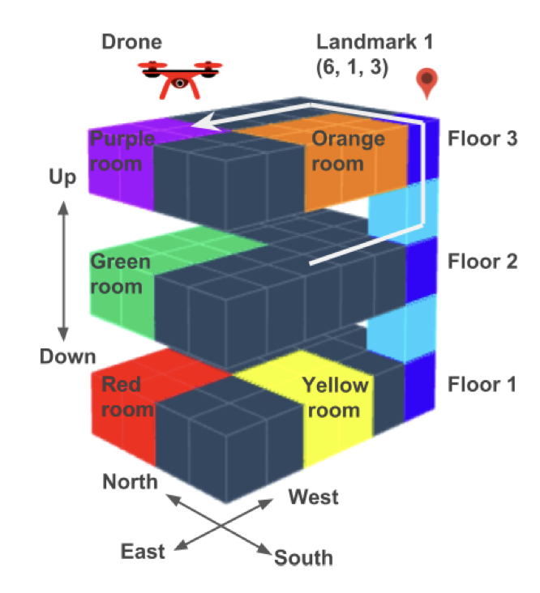

# Logic-LM integrated with Llama-3 and Linear Temporal Logic

### Authors: Niels Sombekke, AnneLouise de Boer, Roos Hutter, Rens Baas, Sacha Buijs
---

In this blogpost, we explore, reproduce, and build upon the findings from the paper [LOGIC-LM: Empowering Large Language Models with Symbolic Solvers for Faithful Logical Reasoning](https://arxiv.org/abs/2305.12295). This paper presents a novel framework, Logic-LM, which integrates Large Language Models (LLMs) with symbolic solvers to improve logical problem-solving.

The objective of this blogpost are:
1. Reproducing the results of the original paper to investigate its reproducibility.
2. Making Logic-LM open-source to enhance accessibility.
3. Extending Logic-LM by integrating Linear Temporal Logic.

---

## Introduction
Logic-LM is a novel framework, proposed by Pan et al. [1], that combines Large Language Models (LLMs) and Symbolic Solvers for reasoning tasks. Leveraging the translative power of LLMs, they counterbalance potential inaccuracies in reasoning by employing Symbolic Solvers [2].
Recent advancements in adapting Large Language Models (LLMs) for logical reasoning tasks can be categorized into two main approaches: fine-tuning and in-context learning. Fine-tuning methods optimize LLMs' reasoning ability through specialized training modules [11], [12], [13], while in-context learning designs prompts to elicit step-by-step reasoning. Chain-of-Thought prompting [14], [15] is an example of in-context learning, in which explanations are generated before the final answer. While these methods operate directly over natural language, the Logic-LM framework stands out by utilizing symbolic language for reasoning, transferring complex tasks to external symbolic solvers while leveraging LLMs for problem formulation. Unlike prior neuro-symbolic methods [16], [17], [18], [19], [20], [21], which often require specialized modules and suffer from optimization challenges, the Logic-LM framework integrates modern LLMs with symbolic logic without the need for complex module designs, offering a more generalizable solution. Additionally, this work explores tool-augmented LLMs, extending their capabilities beyond language comprehension by integrating external tools for improved performance on logical reasoning tasks. While auto-formalization has been widely applied in mathematical reasoning [22], [23], [24], [25], Pan et al. [1] pioneer its extension to a broader range of logical reasoning tasks, bridging the gap between natural language understanding and formal logic with modern LLMs.

<table align="center">
  <tr align="center">
      <td></td>
  </tr>
  <tr align="left">
    <td colspan=2><b>Figure 1.</b>  Overview of the LOGIC-LM model, which consists of three modules: (1) Problem Formulator generates a symbolic representation for the input problem with LLMs via in-context learning (2) Symbolic Reasoner performs logical inference on the formulated problem, and (3) Result Interpreter interprets the symbolic answer. Figure by Pan et al. [1]</td>
  </tr>
</table>

The Logic-LM decomposes a logical reasoning problem into three stages: *Problem Formulation*, *Symbolic Reasoning*, and *Result Interpretation* (Figure 1). The *Problem Formulation* prompts an LLM to translate a natural language problem into symbolic language, utilizing the few-shot generalization ability of LLMs. The LLM is provided with instructions about the grammar of the symbolic language alongside in-context examples. Specifically, four different symbolic formulations are used to cover four common types of logical reasoning problems: deductive reasoning, firstorder logic reasoning, constraint satisfaction problem, and analytical reasoning (Table 1). Afterwards, in the *Symbolic Reasoning* stage, external solvers perform inference on the symbolic representation. Based on the problem type a different solver is used. The *Result Interpreter* explains the output of the solver and maps it to the correct answer. Moreover, a self-refinement module is introduced which improves accuracy by iteratively revising symbolic formulations using error messages from the solvers. This module instructs the LLM to refine incorrect logical forms by prompting it with the erroneous logic form, the solver’s error message, and a set of demonstrations showing common error cases and remedies.

| Problem                | Formulation | NL Sentence                                                                 |            Symbolic Formulation                                     |                Solver                  |      Dataset       |      
|------------------------|-------------|-----------------------------------------------------------------------------|---------------------------------------------------------|-----------------------------------------------------|-------------------|
| Deductive Reasoning    | LP          | If the circuit is complete and the circuit has the light bulb then the light bulb is glowing. | Complete(Circuit, True) ∧ Has(Circuit, LightBulb) → Glowing(LightBulb, True) | Pyke              | ProntoQA, ProofWriter |
| First-Order Logic      | FOL         | A Czech person wrote a book in 1946.                                        | ∃x₂∃x₁(Czech(x₁) ∧ Author(x₂, x₁) ∧ Book(x₂) ∧ Publish(x₂, 1946)) | Prover9           | FOLIO                 |
| Constraint Satisfaction| CSP         | On a shelf, there are five books. The blue book is to the right of the yellow book. | blue_book ∈ {1, 2, 3, 4, 5} yellow_book ∈ {1, 2, 3, 4, 5} blue_book > yellow_book | python-constraint | LogicalDeduction      |
| Analytical Reasoning   | SAT         | Xena and exactly three other technicians repair radios                      | repairs(Xena, radios) ∧ Count([t:technicians], t ≠ Xena ∧ repairs(t, radios)) == 3 | Z3                | AR-LSAT               |
| Temporal reasoning  | LTL         | Go through the red room to the second floor.                    |F(red_room ∧ F (second_floor)) | Büchi Automaton                | Drone Planning             |

**Table 1**: A summary of the symbolic formulations and symbolic solvers we use for categories of logical reasoning in our study.

The performance of three GPT models serving as underlying models for the Problem Formulator of Logic-LM (ChatGPT, GPT-3.5, and GPT-4) is evaluated against two baselines: 1) Standard LLMs, which leverage in-context learning to directly answer the question; and 2) Chain-of-Thought (CoT) [14], which adopts a step-by-step problem-solving approach. The performance is evaluated across five logical reasoning datasets. *PrOntoQA* [26] offers synthetic challenges for deductive reasoning, with the hardest 5-hop subset tested. *ProofWriter* [27] presents problems in a more natural language form under the open-world assumption, focusing on different levels of reasoning depth, with the depth-5 subset chosen for evaluation. *FOLIO* [28], a challenging expert-written dataset, demands complex first-order logic reasoning. *LogicalDeduction* [29] from BigBench and *AR-LSAT* [30] present real-world scenarios and analytical logic reasoning questions, respectively. Additionally, the effect of the refiner is researched by investigating the accuracy and the executable rates on the FOLIO dataset across different rounds of self refinement. 

Pan et al. [1] present three main results. First, LOGIC-LM notably outperforms standard LLMs and Chain-of-Thought (CoT) across various datasets, showcasing the advantage of integrating LLMs with external symbolic solvers for logical reasoning. Second, GPT-4 exhibits superior performance compared to GPT-3.5, especially in standard prompting. Logic-LM further improves GPT-4 24.98% and 10.44% for standard prompting and CoT prompting, respectively. Third, while CoT generally enhances LLM performance, its benefits vary across datasets, with less substantial or negative effects seen in certain scenarios. Additionally, the effectiveness of problem formulation, the robustness of reasoning, and the impact of self-refinement, highlight both the successes and challenges encountered in these areas.

## <a name="reasons">Reasons for extension</a>
As outlined in the introduction, the Logic-LM framework is tested on three LLMs: ChatGPT, GPT-3.5, and GPT-4. However, due to their closed-source nature, these models suffer from limited transparency, customization options, and opportunities for collaboration. Therefore, integrating open-source LLMs into the Logic-LM framework would be beneficial, as it increases accessibility, usability and flexibility. For this first extension, we included two versions of the state-of-the-art model Llama-3.

The authors of Logic-LM pointed out a crucial constraint, stating that “the model’s applicability is inherently bounded by the expressiveness of the symbolic solver” [1]. Currently, the framework utilizes only four distinct symbolic solvers, restricting its scope to four specific types of logical reasoning problems. The current solvers in Logic-LM do not facilitate reasoning about temporal aspects, which limits the model's applicability in scenarios where time-based reasoning is essential. Therefore we opted to include Linear Temporal Logic into the framework. LTL allows for the encoding of formulas about the future of paths, enabling the framework to handle tasks that require an understanding of temporal sequences and future events. By integrating LTL into the Logic-LM framework, we can extend its functionality to encompass temporal logic reasoning, thus broadening its applicability and making it a more powerful tool for a variety of logical reasoning tasks.

Additionally, we will reproduce the results of the original paper to investigate its reproducibility. As the authors utilized closed-source models, we have opted to reproduce the results on a smaller scale using the web version of ChatGPT.

In summary, our contributions are threefold:

1. Reproducing the results of the original paper to investigate its reproducibility.
2. Making Logic-LM open-source to enhance accessibility.
3. Extending Logic-LM by integrating Linear Temporal Logic.

## Reproducing the original results
For the first stage of the Logic-LM framework, the *Problem Formulation*, a natural language problem is translated into symbolic language. The authors of Logic-LM employed three closed-source LLMs (ChatGPT, GPT-3.5, and GPT-4), whereas our extension involves the open-source LLM Llama-3. In an attempt to reproduce their results, we utilized the [web version of ChatGPT](https://chat.openai.com/) (gpt-3.5-turbo) which is publicly accessible for manual query-based messaging. 

For this reproducibility experiment, we manually queried ChatGPT ten times for each symbolic language. The input consisted of the prompt, which includes instructions about the grammar of the symbolic language and in-context examples, and a new problem and question. After the *Problem Formulation* stage, the same setup as the original paper is used for the *Symbolic Reasoning* and *Result Interpretation* stages. 

## <a name="open_source">Extension: Open-source models</a>
Our first extension is making Logic-LM work with open-source language models, instead of closed-source models like ChatGPT. To make the application as flexible as possible, this was applied by using models from the [Huggingface library](https://huggingface.co/meta-llama/Meta-Llama-3-8B-Instruct). Two versions of the current state-of-the-art open-source model Llama-3 have been utilized. First, the smaller 8B version of the model is implemented and evaluated to see how well Logic-LM performs with a lower resource model. Additionally, the larger version of Llama-3 (70B) is utilized to extend Logic-LM, which is expected to outperform the 8B variant due to its significantly larger size. Both models are be compared with the GPT models used by the original author to see how SoTA open-source models compare to closed-source models. 

### Experiments
Following the methodology of the original paper, we evaluate the two Llama3 models on five common logical reasoning datasets (as explained in the introduction). The models are compaired against two baselines 1) Standard LLMs; and 2) Chain-of-Thought (CoT) [14]. Follwing Pan et al. [1], we ensure fair comparisons by using the same in-context examples for all models. For reproducibility, we set the temperature to 0 and select the highest-probability response from the LLMs. We evaluate model performance based on the accuracy of selecting the correct answer from multiple-choice questions. Additionally, we the research the effect of the refiner on the two Llama-3 models by investigating the accuracy and the executable rates on the FOLIO dataset across different rounds of self refinement. 

## <a name="ltl">Extension: Linear Temporal Logic</a>
In addition to standard propositional logic, we extend the Logic-LLM by introducing Linear-time Temporal Logic (LTL), which enables the expression of properties that hold over time-based trajectories. This extension is particularly useful in robotics and automated planning, where paths must comply with temporal constraints [9]. The sematics of LTL are shown in Appendix A.

The integration of Linear Temporal Logic (LTL) in Logic-LM involves several components, as illustrated in Figure 2. The input problem consists of a context, a question, and three multiple-choice options. The context sets the environment for answering the question. The problem formulator translates the question and options into logic formulas suitable for the solver. Specifically, the question is first converted into an easier canonical LTL representation, and then into the raw LTL formula. The options are translated into runs. The symbolic reasoner then evaluates each run to determine if it satisfies the LTL formula using a Büchi automaton. These results are passed to the result interpreter, which generates the answer. We will test and evaluate this extension based on a drone planning scenario [8]. Additionally, we perform an experiment evaluating the performance of three LLMs in converting natural language to LTL and runs. Further details are provided in the following sections.

<table align="center">
  <tr align="center">
      <td></td>
  </tr>
  <tr align="left">
    <td colspan=2><b>Figure 2.</b> Overview of the Logic-LM model extended for LTL, which consists of three modules: (1) Problem Formulator generates a LTL formula and runs for the input question and options respectively with LLMs via in-context learning (2) Symbolic Reasoner performs logical inference on the formulated problem via a Büchi automaton, and (3) Result Interpreter interprets the symbolic answer.</td>
  </tr>
</table> 

### Problem Formulator

We utilize two Llama-3 models to convert natural language into Linear Temporal Logic (LTL) tasks and runs based on the context attributes (e.g., planning domain), the question, and the options (Figure 2, step 1). We provide the models with clear instructions and a few examples to facilitate few-shot learning. This approach helps establish a correspondence between natural language commands and their respective LTL formulas and runs. With the given prompts, the LLMs are directed to generate these LTL formulas and runs from natural language inputs effectively.

For illustration, consider the following Natural language commands $\mu$, and their corresponding LTL formula $\psi_{\mu}$, and explanation dictionary $(D_{\psi})$ generated by a LLM

> **$\mu:$ "Always avoid the green room and navigate to the third floor."**
> 
> $\psi_{\mu}$: $G( \neg greenroom) \land F thirdfloor$
> 
> $D_{\psi}$: {"Always avoid the green room": "G(¬greenroom)","Navigate to the third floor": "F thirdfloor"}

#### Prompt Engineering
Since Large language models are predominantly trained on natural language, they may struggle converting natural language directly into Linear Temporal Logic (LTL) formulas. The syntax of LTL (e.g. X, U, and F) is quite different from typical natural language constructs. To address this distribution shift, a study by Pan et al. [1] proposes creating a *canonical* representation that aligns more closely with natural language [8]. For the same reason Cosler et al.  prompt the LLM to turn $\mu$ into an intermediate *canoncial form*, shown as *sub-translations*, before mapping the the sentence into an LTL formula . Each translation accompanies a translation dictionary in canonical form, through which th LLM is asked to explain its steps. We will use their prompting technique. 

The outline below encapsulates our prompt setup, comprising three main sections — (1) LTL specification for the conversion of Natural Language to LTL, (2) the conversion of multiple choice options to runs, and (3) few-shot examples. All in all, the prompt serves as a structured framework for generating LTL formulas and runs from natural language inputs.

>**Prompt**
>
>Given a context, question and options. The task is to first parse the question into a canonical formular and then from this formula to raw LTL formula. Also the options need to parsed into runs.
Below an explanaition is given of all the input you will recieve and what you should do with it.
>
>**Context**: Declares the scene in which the question needs to be answered. Use this knowledge to parse the question and the options.
>
>***Question**: Contains the question that needs to be answered. The task is to parse the question into a canonical formula and then based on the canonical formular to a raw LTL formula.*
>
>*Your raw LTL formula answers always need to follow the following output format and you always have to try to provide a LTL formula. You may repeat your answers.*
>
>*Remember that U means "until", G means "globally", F means "eventually", which means GF means "infinitely often".*
>
>*The formula should only contain atomic propositions or operators ||, &, !, U, G, F.*
>
>***Options**: The options need to be parsed into runs. These runs need to be a list ([]) containing dictionaries for each timestep ({}). In each dictionary the state of the corresponding timestep is given.*
>
>[Few shot examples]
>
>

<table align="center">
  <tr align="center">
      <td></td>
  </tr>
  <tr align="left">
    <td colspan=2><b>Figure 3.</b>  Pipeline: Converting Natural Language to Linear Temporal Logic for Multiple Choice Answering.</td>
  </tr>
</table>

### <a name="ltl">Symbolic Reasoner</a>
After the problem formulator has translated the natural language question into LTL and options into runs, we pass them to the logical reasoner. This reasoner checks for the validity of runs, verifying whether a given run satisfies the specified LTL formula. Runs are either accepted or rejected based on their compliance with the LTL formula, and consequently, the model is able to select one of the multiple-choice answers. 

The LTL formula is first converted to a Deterministic Finite State Automaton (DFA), next the runs are passed to the Büchi automatom (Figure 3). This is a theoretical machine that either accepts or rejects inputs (further details in Appendix B). To derive the LTL formulas associated DFA we employ a Python module. We integrated the [*Flloat*](https://pypi.org/project/flloat/) Python library to translate LTL formulas (in CNF form) with finite-trace (runs) semantics into a minimal DFA [3]. This conversion is guaranteed by Theorem 1. The resulting  DFA ($M_{\phi}$) encapsulates the temporal constraints specified by the LTL formula, enabling efficient reasoning over finite runs.  Therefore the DFA and the runs are passed to the aforementioned Büchi automaton, which determines if a run is satisfiable within the corresponding LTL formula. The run-based satisfiability reasoning enables the framework's capability to address temporal aspects of logical reasoning problems.

**Theorem 1 [Vardi and Wolper, 1994]**: For any LTL formula $\psi$, a Büchi automaton $M_{\psi}$ can be constructed, having a number of states that is at most exponential in the length of $\psi$.  The language of $M_{\psi}$, denoted as $L(M_{\psi})$, encompasses the set of models of $\psi$ [10].

Finally, the result interpreter translates the results returned from the symbolic solver back to a natural language answer (Figure 1, step 3). The symbolic reasoner returns "True" or "False" for each of the runs (options), this results in a list. From this list the results interpreter takes the index of the "True" value and maps it to the letter corresponding to the correct answer, *e.g. translating [True, False, False] to "the answer is A"*.

### Experiments
We evaluate LOGIC-LM LTL extension on a dataset derived from commands in the *drone planning* domain, adapted from [8]. This test set is generated from the planning domain introduced by [8], This environment is a 3D grid world that consists of three floors, six rooms, and a single landmark (Figure 4). We created a test set of 50 entries with each three multiple-choice options from their natural language descriptions and corresponding LTL formulas. Mirroring the original paper, we evaluate the LOGIC-LM LTL extension against 2 baselines:  1) Standard LLMs; and 2) Chain-of-Thought (CoT) [14]. Additionally we perform an experiment evaluating how well various LLMs convert Natural Language to LTL, this will be further discussed in the following section.

<table align="center">
  <tr align="center">
      <td></td>
  </tr>
  <tr align="left">
    <td colspan=2><b>Figure 4.</b> Planning domain for the drone navigation. Figure by [8].</td>
  </tr>
</table> 

#### Natural language to LTL
We aim to evaluate how well LLMs performs the conversion task from natural language to LTL in cases where it needs to generalize from few examples (few-shot learning). The evaluation consists of two stages: (1) the conversion of the natural language command into LTL, and (2) the subsequent conversion of the multiple choice options (each formlated in natural language) into runs. 

We test the parsing on two datasets. The first dataset derived from the *drone planning* domain, which is priorly discussed and used for the Logic-LM LTL extension evaluation [8]. The second dataset consists of 36 benchmark intances crafted by experts in the nl2spec study . Each of these examples has been selected by LTL experts to cover a variety of ambiguities and complexities. We use their formatted intances.(*[nl2spec original](https://github.com/realChrisHahn2/nl2spec/blob/main/datasets/expert_LTL_dataset.txt)*) In addition, we have replaced the propositions a,b,c,d to create more realistic sentences in natural language (*[nl2spec in NL](https://github.com/NSombekke/Logic-LLM/blob/main/src/LTLnl2spec/LTL2resultsGPT3.csv)*). For example:

> $\mu:$ Every meal is eventually followed by dessert. $\leftrightarrow$ G(meal -> F dessert).
> 
> $\mu:$ Whenever a car starts, the engine revs three steps later. $\leftrightarrow$ G(car_starts -> X X X engine_revs).

The first dataset will be used to test both the initial conversion and the subsequent generation of runs, while the second dataset will be used to test solely the initial conversion from natural language to LTL.

## <a name="results">Results and analysis</a>

### <a name="reproducibility results">Reproducibility</a>
<table align="center">
	<tr align="center">
    	<th>Dataset</th>
    	<th>Overall accuracy (original paper)</th>
    	<th>Overall accuracy (10 examples)</th>
    	<th>Executable rate (10 examples)</th>
    	<th>Executable accuracy (10 examples)</th>
	</tr>
		<tr align="center">
    	<td>ProntoQA</td>
    	<td>61.00</td>
    	<td>40.0</td>
    	<td>10.0</td>
    	<td>100.0</td>
	</tr>
		<tr align="center">
    	<td>ProofWriter</td>
    	<td>58.33</td>
    	<td>50.0</td>
    	<td>40.0</td>
    	<td>100.0</td>
	</tr>
	<tr align="center">
    	<td>FOLIO</td>
    	<td>62.74</td>
    	<td>50.0</td>
    	<td>50.0</td>
    	<td>60.0</td>
	</tr>
		<tr align="center">
    	<td>LogicalDeduction</td>
    	<td>65.67</td>
    	<td>50.0</td>
    	<td>100.0</td>
    	<td>50.0</td>
	</tr>
	<tr align="center">
    	<td>AR-LSAT</td>
    	<td>26.41</td>
    	<td>10.0</td>
    	<td>10.0</td>
    	<td>0.0</td>
	</tr>
    <tr align="left">
   	 <td colspan=7><b>Table 2.</b> Results of Logic-LM (without self-refinement) with Chat-GPT (gpt-3.5-turbo).</td>
</table>

To investigate the reproducibility of the original Logic-LM paper, we manually queried ChatGPT with the prompts and new problems and questions. As notable in Table 2, the overall accuracy of the ten examples is significantly lower than that of the original paper. However, this is likely due to the difference in number of examples, as the original paper tested on 200-600 examples for each symbolic language dataset and our selection might have accidentally included poor examples. Additionally, an interesting observation is the very low executable rate of the PrOntoQA dataset (in the original paper, GPT-3.5 and GPT-4 had 99.4% and 100.0% executable rate, respectively). Disregarding this, a similar trend in the scores is noticeable. Specifically, the AR-LSAT dataset with analytical logic reasoning questions has the lowest accuracy, while the others have a similar, more than double the amount of accuracy. 

When observing the output of ChatGPT, the symbolic language seems like a feasible translation of the natural language problems, only differing slightly with those of the original paper. Thus we can conclude successful reproducibility.

### <a name="general results">LLama as an open-source LLM for Logic-LM </a>
<table align="center">
	<tr align="center">
		<th align="left"></th>
		<th></th>
		<th>Llama-3 (8B)</th>
		<th></th>
		<th></th>
		<th>Llama-3 (70B)</th>
		<th></th>
	</tr>
	<tr align="center">
		<th align="left">Dataset</th>
		<th>Standard</th>
		<th>CoT</th>
		<th>Logic-LM</th>
		<th>Standard</th>
		<th>CoT</th>
		<th>Logic-LM</th>
	</tr>
	<tr align="center">
		<td align="left">ProntoQA</td>
		<td>48.80</td>
		<td>81.00</td>
		<td>67.40</td>
		<td>71.20</td>
		<td><b>89.20</b></td>
		<td>61.60</td>
	</tr>
	<tr align="center">
		<td align="left">Proofwriter</td>
		<td>34.33</td>
		<td><b>49.17</b></td>
		<td>37.83</td>
		<td>49.67</td>
		<td>61.33</td>
		<td><b>74.17</b></td>
	</tr>
	<tr align="center">
		<td align="left">FOLIO</td>
		<td><b>51.96</b></td>
		<td>51.00</td>
		<td>36.27</td>
		<td>61.27</td>
		<td></td>
		<td>57.35</td>
	</tr>
	<tr align="center">
		<td align="left">LogicalDeduction</td>
		<td>35.33</td>
		<td>39.00</td>
		<td><b>60.67</b></td>
		<td>57.67</td>
		<td>49.00</td>
		<td><b>77.00</b></td>
	</tr>
	<tr align="center">
		<td align="left">AR-LSAT</td>
		<td><b>24.68</b></td>
		<td>20.80</td>
		<td>15.15</td>
		<td><b>29.00</b></td>
		<td>27.27</td>
		<td>28.57</td>
	</tr>
		<tr align="center">
		<td align="left">LTL</td>
		<td><b>68.00</b></td>
		<td>44.00</td>
		<td>18.00</td>
		<td><b>76.00</b></td>
		<td>62.00</td>
		<td>28.00</td>
	</tr>
	<tr align="left">
		<td colspan=7><b>Table 3.</b> Accuracy of standard prompting (Standard), chain-of-thought prompting (CoT), and our method (Logic-LM, without self-refinement) across five reasoning datasets using the Llama-3 model. The best results for each base dataset are highlighted. Additionally the results of the LTL extension are shown. (TODO missende waarden)</td>
	</tr>
</table>

Table 3 shows the results of the experiments with the open-source model. For Llama-3 8B it shows that Logic-LM only scored highest on the LogicalDeduction dataset (60.67), compared to Standard (35.33) and CoT (39.00). For the other datasets Logic-LM is outperformed by either the Standard or the CoT method. 

Llama-3 70B outperforms Llama-3 8B, but Logic-LM still does not achieve total superior performance compared to the baselines. However, it does score significantly better on Proofwriter and LogicalDeduction than the Standard and CoT methods. Still Logic-LM gets outperformed on the other datasets, although the difference on AR-LSAT is not very large. 

One reason for Logic-LM's comparatively lower performance could be the dataset used to train Llama-3, which may lack symbolic language logic problems. According to a blog by [daily.dev](https://daily.dev/blog/meta-llama-3-everything-you-need-to-know-in-one-place), while Llama-3 was trained to excel in logical problems and reasoning compared to Llama-2, this training likely focused more on logical reasoning with natural language rather than converting it into symbolic language logic. Consequently, Logic-LM performs well with the Standard and CoT methods, where natural language logic is employed, but struggles when dealing with symbolic language tasks like converting from natural to symbolic logic.

Logic-LM does score high on the LogicalDeduction dataset, which might mean that Llama-3 was trained more on constraint satisfaction. Another explanation for the high performance on LogicalDeduction could be that it is easier for the model to convert the natural language to symbolic logic, because the symbolic formulation of constraint satisfaction logic is much simpler and more familiar to natural language compared to other logic types, making it achieve a higher score.

Comparing these results to the GPT model results from the original paper [1], we observe that the 8B version of Llama-3 generally performs worse than the GPT models. Logic-LM has significantly lower scores compared to all GPT models for the Proofwriter, FOLIO and AR-LSAT dataset and slightly lower scores for the LogicalDeduction dataset. Only on the PrOntoQA Llama-3 8B achieved a higher score than gpt-3.5-turbo, while still having worse scores when using the other GPT models. For the Standard and CoT method we observe similar performance to gpt-3.5-turbo while also being outperformed by the other GPT models. 

The 70B version however does achieve more similar scores as the OpenAI models. While still being outperformed by GPT-4 on all datasets, it does score higher than ChatGPT and GPT-3.5 on some datasets. It outperforms ChatGPT on all datasets except FOLIO and outperforms GPT 3.5 on both Proofwriter and LogicalDeduction. Llama-3 70B's better performance compared to the 8B version was to be expected, since Llama-3 70B is significantly larger and also performs better in Meta's own [benchmarks](https://ai.meta.com/blog/meta-llama-3/). Taking this into account, it is noteworthy that the 8B version outperforms the 70B version on ProtoQA, achieving a score of 67.40 versus the 61.60 from 70B.

### <a name="LTL results">LTL extension</a>

#### (1) Perfomance Logic-LM for LTL
<!--<table align="center">
  <tr>
    <th>Metric</th>
    <th>Llama-3-8B</th>
    <th>Llama-3-70B</th>
  </tr>
  <tr>
    <td>Standard</td>
    <td><b>68.00</b></td>
    <td><b>76.00</b></td>
  </tr>
  <tr>
    <td>CoT</td>
    <td>44.00</td>
    <td>62.00</td>
  </tr>
  <tr>
    <td>Logic-LM</td>
    <td>18.00</td>
    <td>28.00</td>
  </tr>
  <tr>
    <td>Exec-rate of Logic-LM</td>
    <td>66.00</td>
    <td>52.00</td>
  </tr>
  <tr>
    <td>Exec-acc of Logic-LM</td>
    <td>72.73</td>
    <td>100.00</td>
  </tr>
	<tr align="left">
		<td colspan="3"><b>Table 6: </b>LTL analysis: Accuracies for Standard, CoT and Logic-LM on LTL (drone planning dataset) with two Llama-3 models; And the corresponding executable rates.</td>
	</tr>
</table>-->
Our study delves into the integration of Linear Temporal Logic (LTL) within the Logic-LM framework. This process involves translating natural language into LTL formulas and runs, and then applying a Büchi automaton (symbolic solver) to these formulas.

Table 3 showcases the results of this extension alongside baseline methods and the logics from Pan et al. [1]. For both Llama-3 models, the standard method achieves the best performance. As anticipated, the larger Llama-3-70B model consistently outperforms the Llama-3-8B model across all methods. Notably, Logic-LM demonstrates the poorest performance.

A more detailed analysis of Logic-LM for LTL is provided in Table 5, revealing potential reasons for its low accuracy. The primary issue seems to be that multiple or no answers are considered correct simultaneously, which should not happen. This problem could arise from incorrect translation of natural language into the corresponding LTL formulas, as elaborated in the next section, or from inaccuracies in the translation to runs. Additionally, it is important to note that the dataset was partially manually created, which could have introduced further errors.

When we examine the accuracy for questions that yielded exactly one correct answer, the results are 47% and 93% for the 8B and 70B models, respectively (Table 5). Comparing these results to the baselines, we see that the Llama-8B Logic-LM outperforms CoT, and the Llama-70B outperforms all methods. This observation suggests that improvements in the prompt or the refiner could help the model overcome current limitations, providing a promising starting point for future research.

Comparing LTL against other the logical reasoning tasks (Table 3), we observe that the standard method performs relatively very well on LTL, while CoT shows medium performance and Logic-LM performs poorly. It is important to note that the differences in performance between the methods are much smaller within the other logical reasoning datasets, which may again be attributed to the translation inaccuracies of the model.

Future investigations could encompass a comprehensive evaluation of conversion accuracy across diverse LTL formulae, along with an in-depth analysis of how contextual factors within the planning domain influence run generation. An exploration into whether the LLMs can infer abstract relationships, such as associating rooms with floors, will provide valuable insights into their reasoning capabilities at abstracted levels.

<table align="center">
	<tr align="center">
		<th>Accuracy on drone planning dataset</th>
		<th>Llama3-8b</th>
		<th>Llama3-70b</th>
	</tr>
	<tr align="center">
		<td>Accuracy (correct/all data)</td>
		<td>18% (9/50)</td>
		<td>28% (14/50)</td>
	</tr>
	<tr align="center">
		<td>Accuracy against all one answer data (correct/(correct+incorrect))</td>
		<td>47% (9/19)</td>
		<td>93% (14/15)</td>
	</tr>
	<tr align="center">
		<td>No answer</td>
		<td>32% (16/50)</td>
		<td>42% (21/50)</td>
	</tr>
	<tr align="center">
		<td>Two answers</td>
		<td>20% (10/50)</td>
		<td>16% (8/50)</td>
	</tr>
	<tr align="center">
		<td>Three answers</td>
		<td>10% (5/50)</td>
		<td>12% (6/50)</td>
	</tr>
	<tr align="center">
		<td>Executable rate</td>
		<td>98% (49/50)</td>
		<td>94% (47/50)</td>
	</tr>
	<tr align="left">
		<td colspan="3"><b>Table 5: </b>Analysis of Logic-LM results for LTL on the drone planning dataset. The table shows the overall accuracy of correct predictions across the entire dataset, followed by the accuracy when considering only the questions that yielded exactly one correct answer. Additionally, it presents the percentage of questions that resulted in either fewer than one or more than one correct answer, indicating faulty predictions.</td>
	</tr>
</table>

<!--Our study represents an exploration into a novel methodology that combines natural language to LTL conversion and trace generation through prompting—a methodology not previously attempted, to the best of our knowledge. Notably, unlike previous approaches that rely on trajectory planners fed with LTL expressions, we introduce the predefined environment directly into the multiple-choice questions in natural language format, under the context section of the prompt. Future investigations could encompass a comprehensive evaluation of conversion accuracy across diverse LTL formulae, along with an in-depth analysis of how contextual factors within the planning domain influence run generation. An exploration into whether the LLMs can infer abstract relationships, such as associating rooms with floors, will provide valuable insights into their reasoning capabilities at abstracted levels.-->

<!--Regarding the question of whether LLMs can infer that rooms belong to floors, this line of inquiry delves into abstract reasoning levels. The results from the multiple-choice options in the planning domain demonstrate that while ambiguity may hinder exact matches, it can facilitate effective executions in certain instances—wherein the generated answer aligns with the intended outcome, even if the LTL formula of the test set does not match exactly.-->

#### (2)  Evaluating NL to LTL Conversion
By testing the NL to LTL conversion on the *nl2spec* dataset , we seek to understand how well the LLM can handle the translation from natural language to LTL at various levels of complexities, and to provide insights into potential areas for improvement in future iterations.

<table align="center">
    <tr align="center">
        <th>Dataset</th>
        <th>GPT-4.o </th>
        <th>GPT-3.5 </th>
        <th>Llama3-70b-instruct </th>
    </tr>
    <tr align="center">
        <td>nl2spec original</td>
        <td>23/36 (63.88%)</td>
        <td>18/36 (50.00%)</td>
        <td>23/36 (63.88%)</td>
    </tr>
    <tr align="center">
        <td>nl2spec in NL</td>
        <td>26/36 (72.22%)</td>
        <td>17/36 (47.22%)</td>
        <td>19/36 (52.77%)</td>
    </tr>
    <tr align="left">
        <td colspan="4">
            <b>Table 6:</b> Accuracies Over Test Sets using <a href = "https://github.com/NSombekke/Logic-LLM/blob/main/src/models/prompts/LTLCoTnl2spec.txt">CoT</a> (Counting the Number of Exact Matches Between Formulae) 
             <i>For intersecting Büchi automata, we use the following 
            <a href="https://spot.lre.epita.fr/app/">spot</a> model checking software.<i>
        </td>
    </tr>
</table>

      
Our results reveal a notable discrepancy in the performance of Llama3-70b-instruct for NL to LTL conversion using different prompting techniques. CoT prompting achieved an accuracy of 63.88% (23/36), while direct prompting only reached 44.44% (16/36). This stark difference underscores the critical role of structured prompting in enhancing LLM efficacy for complex tasks like logical formula conversion.
		    
The results in Table 6 demonstrate the effectiveness of using LLMs to parse natural language into LTL formulas. Our results show that GPT-4.0 (72.22%) significantly outperforms GPT-3.5 (47.22%) in translating natural language to LTL formulas, indicating enhanced capabilities in processing semantics. Interestingly, GPT-4.0 performs worse on predefined propositions (23/36) compared to NL (26/36), suggesting it is more geared towards handling natural language inputs than structured data. Conversely, GPT-3.5 performs similarly on both sets but is the worst overall. For Llama3-70b, the *original nl2spec* approach, which works with predefined predicates, outperforms the *nl2spec in NL* approach, which extracts predicates from natural language. Predefined predicates provide a clear representation, allowing the LLM to focus on relationships and generate correct LTL formulas.

LLMs are often not entirely incorrect; the formulas generated by GPT-3.5 tend to be less restrictive and more general, occasionally covering the expert's formula without being an exact match. For example, when interpreting the statement *We work every fifth day*, GPT-4.o returns: $G (\text{work} \rightarrow X(\neg \text{work} \land X(\neg \text{work} \land X(\neg \text{work} \land X(\neg \text{work} \land X(\text{work}))))))$, which precisely captures the pattern of working every fifth day. In contrast, GPT-3.5 generates a more general formula: $G (\text{work} \rightarrow X X X X X \text{work})$. This difference demonstrates GPT-4.o's superior ability to capture more complex and specific temporal patterns, providing a more detailed logical representation. 

###### Ambiguity
As pointed out by Cosler et al. [5], natural language can be inherently ambiguous. For instance, consider the structural limitations of natural language due to operator precedence. Take the sentence: _a holds until b holds or always a holds_.  Human experts initially translated this to $(a U b) | G a$. However, GPT-3.5 returns $a U (b | G a)$. Both translations are plausible depending on the interpretation of the sentence. This example illustrates the complexity and potential challenges in converting natural language statements into formal expressions.

> **$\mu:$ "Whenever the food is hot, the food is cold in the next two steps."**
> 
> $\psi_{\mu}$: $G(hot -> X(X(cold)))$
> 
> $D_{\psi}$: {'Whenever': '->', 'the food is hot': 'hot', 'the food is cold': 'cold', 'in the next two steps': 'X(X(cold))'}

The second type of ambiguity stems from semantic ambiguities within natural language, and is illustrated by the following. _Whenever a holds, b must hold in the next two steps_, mapped to $G (a \rightarrow (b | X b))$.  However, it could also be translated as $G((a \rightarrow X(X(b))))$. The correct translation depends on the interpretation of the semantic meaning. The two formulas are incomparable, and GPT-4.0 returns the latter interpretation. Researchers suggest specifying sub-clauses to improve results by providing clearer instructions for the model, offering promising avenues for future research [5].

<table align="center">
  <tr align="center">
    <th>Dataset</th>
    <th>ChatGPT (gpt-3.5-turbo)</th>
    <th></th>
    <th></th>
    <th>GPT-3.5 (text-davinci-003)</th>
    <th></th>
    <th></th>
    <th>GPT-4 (gpt-4)</th>
    <th></th>
    <th></th>
  </tr>
  <tr align="center">
    <th></th>
    <th>Standard</th>
    <th>CoT</th>
    <th>Logic-LM</th>
    <th>Standard</th>
    <th>CoT</th>
    <th>Logic-LM</th>
    <th>Standard</th>
    <th>CoT</th>
    <th>Logic-LM</th>
  </tr>
  <tr align="center">
    <td>PrOntoQA</td>
    <td>47.40</td>
    <td><u>67.80</u></td>
    <td>61.00</td>
    <td>51.80</td>
    <td>83.00</td>
    <td><u>85.00</u></td>
    <td>77.40</td>
    <td><u>98.79</u></td>
    <td>83.20</td>
  </tr>
  <tr align="center">
    <td>ProofWriter</td>
    <td>35.50</td>
    <td>49.17</td>
    <td><u>58.33</u></td>
    <td>36.16</td>
    <td>48.33</td>
    <td><u>71.45</u></td>
    <td>52.67</td>
    <td>68.11</td>
    <td><u>79.66</u></td>
  </tr>
  <tr align="center">
    <td>FOLIO</td>
    <td>45.09</td>
    <td>57.35</td>
    <td><u>62.74</u></td>
    <td>54.60</td>
    <td>57.84</td>
    <td><u>61.27</u></td>
    <td>69.11</td>
    <td>70.58</td>
    <td><u>78.92</u></td>
  </tr>
  <tr align="center">
    <td>LogicalDeduction</td>
    <td>40.00</td>
    <td>42.33</td>
    <td><u>65.67</u></td>
    <td>41.33</td>
    <td>48.33</td>
    <td><u>62.00</u></td>
    <td>71.33</td>
    <td>75.25</td>
    <td><u>87.63</u></td>
  </tr>
  <tr align="center">
    <td>AR-LSAT</td>
    <td>20.34</td>
    <td>17.31</td>
    <td><u>26.41</u></td>
    <td>22.51</td>
    <td>22.51</td>
    <td><u>25.54</u></td>
    <td>33.33</td>
    <td>35.06</td>
    <td><u>43.04</u></td>
  </tr>
  <tr align="left">
  <td colspan=10><b>Table 3.</b>Original paper results [1]: Accuracy of standard promoting (Standard), chain-of-thought promoting (CoT), and our method (LOGICLM,
without self-refinement) on five reasoning datasets. The best results within each base LLM are highlighted.</td>
</table>

## <a name="conclusion">Conclusion</a>
Our experiments show that it is possible to use Logic-LM with open-source language models. However the achieved performance with the used SoTA open-source language model (Llama-3) is shown to be lower than the performance of the closed-source GPT models. The 8B version of Llama-3  generally performed worse than all GPT models, while the 70B version scored more similarly to GPT 3.5, beating ChatGPT while losing to GPT 4.0. It should be noted that once better open-source models become available, they could perform equally as good or better than closed-source models, since the achieved performance is evidently related to the used language model. Using this extension it would be easy to switch open-source models, making it easier to use new higher-performing models in the future.

Using Llama-3 8B we observed that the performance of Logic-LM is significantly worse than the Standard and CoT methods, except on the LogicalDeduction dataset, where Logic-LM performed slightly better. With Llama-3 the results of Logic-LM were a little better, but Logic-LM still did not achieve superior performance compared to the baselines. This contradicts the findings of the original authors, since they found Logic-LM to outperform the other 2 methods on almost all datasets with all three GPT models. This is likely due to a difference in the ability of the model to convert natural language logic into symbolic logic, making the reasoners unable to correctly solve the problems. 

Furthermore we extended Logic-LM to work with LTL. On this logic type Logic-LM had lower performance than the benchmark methods on both Llama-3 versions, while the Standard method performed best. It is likely that an improvement in the prompt or self-refinement could boost performance of Logic-LM for this logic. Comparing the ability of Llama-3 to convert NL into LTL, it was found that GPT 4.o is significantly better in converting NL than Llama-3. Llama-3 70B had a reasonably high accuracy with predefined predicates and achieved much lower accuracy when converting NL. This means that with Llama-3 it is better to use predefined predicates than NL. GPT 4.o on the other hand performed even higher on NL compared to predefined predicates, making it the preferred model for converting NL to LTL.

## Authors' Contributions
*example*
- Rens: Wrote part of introduction, open-source model results and conclusion.
- Roos: ...
- Niels: Implemented the code for Llama models and LTL, acquired all results.
- Sacha: Implemented LTL, wrote introduction and parts of LTL and the results, revised and structured blogpost.
- AnneLouise: Researched the implementation of LTL, added two test sets for LTL, result analysis.

## Bibliography

[1] Pan, L., Albalak, A., Wang, X., & Wang, W. Y. (2023). Logic-lm: Empowering large language models with symbolic solvers for faithful logical reasoning. arXiv preprint arXiv:2305.12295.

[2] Murray Shanahan. 2022. Talking about large language models. CoRR, abs/2212.03551.

[3] Francesco Fuggitti. 2019. LTLf2DFA (Version 1.0.3). Zenodo. DOI: 10.5281/zenodo.3888410. Available at: https://github.com/whitemech/LTLf2DFA and http://ltlf2dfa.diag.uniroma1.it.

[4] Y. Oh, R. Patel, T. Nguyen, B. Huang, E. Pavlick, and S. Tellex, "Planning with State Abstractions for Non-Markovian Task Specifications," CoRR, vol. abs/1905.12096, 2019. [Online]. Available: http://arxiv.org/abs/1905.12096

[5] M. Cosler, C. Hahn, D. Mendoza, F. Schmitt, and C. Trippel, "nl2spec: Interactively Translating Unstructured Natural Language to Temporal Logics with Large Language Models," Mar. 8, 2023. [Online]. Available: arXiv:2303.04864.

[6] Wang, J., Tong, J., Tan, K., Vorobeychik, Y., & Kantaros, Y. (2024). Conformal Temporal Logic Planning using Large Language Models. Retrieved from arXiv:2309.10092 [cs.RO]

[7] S. Simon and G. Röger, "Finding and Exploiting LTL Trajectory Constraints in Heuristic Search," Proceedings of the International Symposium on Combinatorial Search, vol. 6, pp. 113-121, Sep. 2021, doi: 10.1609/socs.v6i1.18361.

[8] J. Pan, G. Chou, and D. Berenson, "Data-Efficient Learning of Natural Language to Linear Temporal Logic Translators for Robot Task Specification," arXiv preprint arXiv:2303.08006, 2023.

[9] C. Wang, C. Ross, Y.-L. Kuo, B. Katz, and A. Barbu, "Learning a natural-language to LTL executable semantic parser for grounded robotics," *CoRR*, vol. abs/2008.03277, 2020. [Online]. Available: https://arxiv.org/abs/2008.03277

[10] M. Y. Vardi and P. Wolper, "Reasoning about Infinite Computations," *Information and Computation*, vol. 115, no. 1, pp. 1-37, 1994. [Online]. Available: https://doi.org/10.1006/inco.1994.1092.

[11] Peter Clark, Oyvind Tafjord, and Kyle Richardson. 2020. Transformers as soft reasoners over language. In Proceedings of the 29th International Joint Conference on Artificial Intelligence (IJCAI), pages 3882–3890.

[12] Oyvind Tafjord, Bhavana Dalvi Mishra, and Peter Clark. 2022. Entailer: Answering questions with faithful and truthful chains of reasoning. In Proceedings of the 2022 Conference on Empirical Methods in Natural Language Processing (EMNLP), pages 2078–2093.

[13] Kaiyu Yang, Jia Deng, and Danqi Chen. 2022. Generating natural language proofs with verifier-guided search. In Proceedings of the 2022 Conference on Empirical Methods in Natural Language Processing (EMNLP), pages 89–105.

[14] Jason Wei, Xuezhi Wang, Dale Schuurmans, Maarten
Bosma, Ed H. Chi, Quoc Le, and Denny Zhou. 2022b.
Chain of thought prompting elicits reasoning in large
language models. CoRR, abs/2201.11903.

[15] Xuezhi Wang, Jason Wei, Dale Schuurmans, Quoc V.
Le, Ed H. Chi, Sharan Narang, Aakanksha Chowdhery,
and Denny Zhou. 2023. Self-consistency improves
chain of thought reasoning in language models.
In Proceedings of the 11th International Conference
on Learning Representations (ICLR).

[16] Jiayuan Mao, Chuang Gan, Pushmeet Kohli, Joshua B.
Tenenbaum, and Jiajun Wu. 2019. The neurosymbolic
concept learner: Interpreting scenes, words,
and sentences from natural supervision. In Proceedings
of the 7th International Conference on Learning
Representations (ICLR).

[17] Nitish Gupta, Kevin Lin, Dan Roth, Sameer Singh, and
Matt Gardner. 2020. Neural module networks for
reasoning over text. In Proceedings of the 8th International
Conference on Learning Representations
(ICLR).

[18] Robin Manhaeve, Sebastijan Dumancic, Angelika Kimmig,
Thomas Demeester, and Luc De Raedt. 2021.
Neural probabilistic logic programming in deepproblog.
The Journal of Artificial Intelligence (AIJ),
298:103504.

[19] Le-Wen Cai, Wang-Zhou Dai, Yu-Xuan Huang, Yu-
Feng Li, Stephen H. Muggleton, and Yuan Jiang.
2021. Abductive learning with ground knowledge
base. In Proceedings of the 30th International Joint
Conference on Artificial Intelligence (IJCAI), pages
1815–1821.

[20] Jidong Tian, Yitian Li, Wenqing Chen, Liqiang Xiao,
Hao He, and Yaohui Jin. 2022. Weakly supervised
neural symbolic learning for cognitive tasks. In Proceedings
of 36th Conference on Artificial Intelligence
(AAAI), pages 5888–5896.

[21] Connor Pryor, Charles Dickens, Eriq Augustine, Alon
Albalak, William Yang Wang, and Lise Getoor. 2023.
Neupsl: Neural probabilistic soft logic. In Proceedings
of the 32nd International Joint Conference on
Artificial Intelligence (IJCAI), pages 4145–4153.

[22] YuhuaiWu, Albert Qiaochu Jiang,Wenda Li, Markus N.
Rabe, Charles Staats, Mateja Jamnik, and Christian
Szegedy. 2022. Autoformalization with large language
models. In Proceedings of the Annual Conference
on Neural Information Processing Systems
(NeurIPS).

[23] Iddo Drori, Sarah Zhang, Reece Shuttleworth, Leonard
Tang, Albert Lu, Elizabeth Ke, Kevin Liu, Linda
Chen, Sunny Tran, Newman Cheng, et al. 2022. A
neural network solves, explains, and generates university
math problems by program synthesis and fewshot
learning at human level. Proceedings of the National
Academy of Sciences, 119(32):e2123433119.

[24] Joy He-Yueya, Gabriel Poesia, Rose E Wang, and
Noah D Goodman. 2023. Solving math word problems
by combining language models with symbolic
solvers. CoRR, abs/2304.09102.

[25] Albert Qiaochu Jiang, Sean Welleck, Jin Peng Zhou,
Timothée Lacroix, Jiacheng Liu, Wenda Li, Mateja
Jamnik, Guillaume Lample, and Yuhuai Wu. 2023.
Draft, sketch, and prove: Guiding formal theorem
provers with informal proofs. In Proceedings of the
11th International Conference on Learning Representations
(ICLR).

[26] Abulhair Saparov and He He. 2023. Language models
are greedy reasoners: A systematic formal analysis
of chain-of-thought. In Proceedings of the 11th International
Conference on Learning Representations
(ICLR).

[27] Oyvind Tafjord, Bhavana Dalvi, and Peter Clark. 2021.
Proofwriter: Generating implications, proofs, and
abductive statements over natural language. In Findings
of the 59th Annual Meeting of the Association for
Computational Linguistics (ACL), pages 3621–3634.

[28] Simeng Han, Hailey Schoelkopf, Yilun Zhao, Zhenting
Qi, Martin Riddell, Luke Benson, Lucy Sun, Ekaterina
Zubova, Yujie Qiao, Matthew Burtell, David
Peng, Jonathan Fan, Yixin Liu, Brian Wong, Malcolm
Sailor, Ansong Ni, Linyong Nan, Jungo Kasai,
Tao Yu, Rui Zhang, Shafiq R. Joty, Alexander R. Fabbri,
Wojciech Kryscinski, Xi Victoria Lin, Caiming
Xiong, and Dragomir Radev. 2022. FOLIO: natural
language reasoning with first-order logic. CoRR,
abs/2209.00840.

[29] Aarohi Srivastava, Abhinav Rastogi, Abhishek Rao,
Abu Awal Md Shoeb, Abubakar Abid, Adam
Fisch, Adam R. Brown, Adam Santoro, Aditya
Gupta, Adrià Garriga-Alonso, Agnieszka Kluska,
Aitor Lewkowycz, Akshat Agarwal, Alethea Power,
Alex Ray, Alex Warstadt, Alexander W. Kocurek,
Ali Safaya, Ali Tazarv, Alice Xiang, Alicia Parrish,
Allen Nie, Aman Hussain, Amanda Askell,
Amanda Dsouza, Ameet Rahane, Anantharaman S.
Iyer, Anders Andreassen, Andrea Santilli, Andreas
Stuhlmüller, Andrew M. Dai, Andrew La, Andrew K.
Lampinen, Andy Zou, Angela Jiang, Angelica Chen,
Anh Vuong, Animesh Gupta, Anna Gottardi, Antonio
Norelli, Anu Venkatesh, Arash Gholamidavoodi,
Arfa Tabassum, Arul Menezes, Arun Kirubarajan,
Asher Mullokandov, Ashish Sabharwal, Austin Herrick,
Avia Efrat, Aykut Erdem, Ayla Karakas, and
et al. 2022. Beyond the imitation game: Quantifying
and extrapolating the capabilities of language models.
CoRR, abs/2206.04615.

[30] Wanjun Zhong, Siyuan Wang, Duyu Tang, Zenan Xu,
Daya Guo, Yining Chen, JiahaiWang, Jian Yin, Ming
Zhou, and Nan Duan. 2022. Analytical reasoning of
text. In Findings of the 2022 Conference of the North
American Chapter of the Association for Computational
Linguistics: Human Language Technologies
(NAACL-HLT), pages 2306–2319.

## Appendix
### Appenix A: Semantics of LTL

LTL's semantics can effectively capture command specifications in the temporal domain. Formulas in LTL over the set of atomic propositions ($P$) adhere to the grammar below. For example, to express the statement "A cat never sleeps" in LTL, you would write $G \neg sleep$ in temporal logic. In this formula, the $G$  operator (Globally) indicates that the property it precedes must hold at all times in the future, and the $\neg$ operator (Negation) indicates that the "sleep" property does not hold. These temporal operators may be summarized as follows:

* **Eventually** ($F \varphi$): $\varphi$ will hold at some point in the run.
* **Always** ($G \varphi$): $\varphi$ holds at every time step in the run.
* **Until** ($\varphi \mathcal{U} \psi$): $\varphi$ holds continuously until $\psi$ holds.
* **Next** ($X \varphi$): $\varphi$ holds at the next time step.

$$
\begin{align*}
\text{Syntax} & \quad \text{Description} \\
p & \quad \text{Atomic Proposition } p \in P \\
\neg \varphi & \quad \text{Negation} \\
\varphi \land \psi & \quad \text{And} \\
\varphi \lor \psi & \quad \text{Or} \\
\varphi \Rightarrow \psi & \quad \text{Imply} \\
\varphi \mathcal{U} \psi & \quad \varphi \text{ Until } \psi \\
F \varphi & \quad \text{Eventually} \\
X \varphi & \quad \text{Next} \\
G \varphi & \quad \text{Always}
\end{align*}
$$

In the context of planning, LTL formulas ($\varphi$) are constructed over a set of atomic propositions ($P$). The semantics of an LTL formula $\varphi$ is given with respect to an execution run $\sigma = (s_0, s_1, ..., s_n)$. We consider only LTL over finite traces (runs), which is commonly called $LTL_f$, however, the semantics may descrive an execution runs of infinite length. For $0 \leq i \leq n$, through induction one can define if $\varphi$ is true at instant $i$ (written $w, i \models \varphi$) as:

- $w, i \models p$ iff $p \in L(w_0)$
- $w, i \models \neg \varphi$ iff $w, i \not\models \varphi$
- $w, i \models \varphi_1 \land \varphi_2$ iff $w, i \models \varphi_1$ and $w, i \models \varphi_2$
- $w, i \models X \varphi$ iff $i < n$ and $w, i+1 \models \varphi$
- $w, i \models F \varphi$ iff $\exists j \geq i$ such that $w, j \models \varphi$
- $w, i \models \varphi_1 \mathcal{U} \varphi_2$ iff there exists a $j$ with $i \le j \le n$ s.t. $w, j \models \varphi_2$ and for all $i \le k < j$, $w, k \models \varphi_1$

### Appenix B: Symbolic solver for LTL
The input words **w** of the Büchi automaton ($M_{\psi}$) can be infinite sequences $\sigma_0 \sigma_1 ... \sigma_n \in \Sigma^{w}$ [7]. A *run* of the automaton $(M_{\psi})$ on the word  **w** is sequence of states $\rho = q_0q_1q_2...$, where each state is a set of propositions. The initial state is $q_0$ and subsequent states are defined throught the transition function $q_{i+1} = \Delta(q_i,\sigma_i)$. The language of the automaton $M_{\psi}$ ($L(M_{\psi})$), is a set of *words* characterized by the presence of an accepting run. In this case each accepting run is a valid sequence of states that holds in the automaton. 

<!--(TODO add ref)-->
**Definition 1: (Büchi automaton)**: A deterministic Büchi automaton (DBA) is a tuple $M = (Q, \sum, \Delta, Q_0, F)$ where:
- $Q$ is a finite set of automaton states,
- $\Sigma$ is a finite alphabet of the automaton ($|\Sigma| = 2^{|P|}$),
- $\Delta : Q \times \sum  \rightarrow 2^{Q}$ is the transition function,
- $q_0 \subseteq Q$ is the set of initial stats
- $F \subseteq Q$ is the set of accepting states.

A word **w** is accepted by an automaton ($M_{\psi}$) if its run $\rho$ meets the condition $\lim(\rho) \cap F \neq \emptyset$. Meaning that that the run reaches at least one accepting state in **F**. 

$L(M_{\psi}) = \\{ w \in \Sigma^{w} | w \text{ is accepted by}  M_{\psi} \\}$

For each subplan $q_i$ of the run, the language function $L$ assigns a symbol $\sigma \in \Sigma$. These symbols collectively form a word **w** representing the sequence of symbols observed along the run. This word **w** is then evaluated against the acceptance conditions of the DBA $M_{\psi}$. The language $L(M_{\psi})$ defines a set of infinite runs that the DFA can recognize. If **w** satisfies these acceptance conditions, then the finite run $\rho_{\psi}$ satisfies the LTL formula. Finite runs $\rho_{\psi}$ satisfiy the LTL if the word $ **w** = L(q_0)L(q_1)...L(q_n)$ is acceptable in $L(M_{\psi})$. 

### TODO (dingen die ik nu heb weggehaald maar miss nog moeten blijven?)
The addition of a context in the prompt is not always necessary for correct LTL generation as the LLM is expected to infer when predictes have a mutex (mutually exclusive) conditions (e.g. the predicates sleeping and eating can not hold at the same time). However, we are utilizing a drone planning dataset that contains spefic constraints, such as the impossibility of the drone simultaneously occupying the third floor and a particular room on the first floor. Therefore prompts enriched with a context are utilized in this study.

> **Context**:
>  *Our environment consists of grid-based rooms across multiple floors. Each floor features distinct rooms: the first floor has a red room and a yellow room, the second  floor has a green room, and the third floor includes a purple room, an orange room, and Landmark 1.* *The drone’s movement is limited to one floor and not more than one  room at a time within this structured environment. This setup is crucial for guiding effective planning and decision-making processes within the context of our problem.*
> 
> **Question:**
> Always avoid the green room and navigate to the third floor. Which one of the following is a possible path for the drone to follow?
> 
> **Options:**
> 
> (A) From the third floor go to the green room and stay there,
> 
> (B) Go inside the red room and then move to the green room,
> 
> (C) Go to the second floor passing the yellow room and then go to the third floor
